# TECHNICAL DESIGN DOCUMENT
# SIH26170 — AI-Driven Anomaly Detection in Component Burn-In & Screening
# Indian Space Research Organisation (ISRO)

---

> **DISCLAIMER**: This document describes a prototype assistive decision-support system developed for Smart India Hackathon (SIH). It does NOT constitute official ISRO documentation, certified screening procedures, or validated acceptance criteria. All AI outputs are advisory. Mandatory engineering safety limits always take precedence. All validation in this document uses synthetic/simulated data unless explicitly stated otherwise.

---

## TABLE OF CONTENTS

1. Executive Summary
2. Problem Statement
3. Existing Screening Process
4. Existing System Limitations
5. Proposed Solution
6. Objectives
7. Scope & Assumptions
8. Functional Requirements
9. Non-Functional Requirements
10. High-Level Architecture
11. Physical Test Environment
12. Data Ingestion Architecture
13. Data Architecture & Database Design
14. Data Processing Pipeline
15. Feature Engineering
16. AI/ML Architecture
17. Module A — Dynamic Anomaly Detection
18. Module B — Drift Prediction
19. Multi-Parameter Correlation Analysis
20. Hybrid Risk Fusion Engine
21. Decision Engine
22. Explainable AI
23. Component Health Profile
24. Backend Architecture & Services
25. REST API Design
26. Frontend / Engineering Dashboard
27. Real-Time Architecture
28. Batch Processing Architecture
29. MLOps Architecture
30. Model Evaluation Strategy
31. Dataset Strategy
32. Safety & Fail-Safe Design
33. Security Architecture
34. Observability & Monitoring
35. Deployment Architecture
36. Testing Strategy
37. Auditability
38. Report Generation
39. System Diagrams (Mermaid)
40. Technology Stack & Architectural Decisions
41. Implementation Roadmap
42. SIH Demo Flow
43. Jury-Level Technical Defense
44. Limitations & Future Scope
45. Conclusion

---

## 1. EXECUTIVE SUMMARY

High-reliability electronic components used in space missions undergo Burn-In and Environmental Stress Screening (ESS) to eliminate early-life failures before deployment. Traditional screening relies on fixed electrical threshold checks at predefined time checkpoints. This approach is necessary but insufficient: a component can remain within its absolute specification limits while exhibiting abnormal drift, unusual temporal behaviour, or lot-relative outlier characteristics that are statistically significant precursors to latent failure.

This document describes the complete system architecture for an AI-assisted screening decision-support system that augments — not replaces — traditional threshold-based screening. The system implements two primary AI modules:

- **Module A**: Dynamic Outlier Detection — identifies components that are abnormal relative to their lot population even when they remain within absolute datasheet limits.
- **Module B**: Time-Series Drift Prediction — uses early burn-in measurements to predict the 168-hour value and assess drift risk.

The system is designed as a **Hybrid Safety + AI Architecture** where deterministic hard safety rules always take precedence over AI outputs. The AI layer provides behavioural screening, population-relative analysis, and predictive drift assessment as an assistive layer for engineering review.

The architecture is safe, explainable, auditable, modular, scalable, fail-safe, and implementable within the SIH prototype timeline.

---

## 2. PROBLEM STATEMENT

**Problem ID**: SIH26170
**Organization**: Indian Space Research Organisation (ISRO)
**Domain**: High-Reliability Electronic Components, Burn-In Testing, ESS, AI/ML, Predictive Reliability Engineering

Space-grade electronic components must achieve extremely high reliability. Burn-In and Environmental Stress Screening are standard processes to precipitate and eliminate early-life (infant mortality) failures. However:

1. Traditional screening checks fixed electrical/parametric thresholds at predefined checkpoints (0h, 24h, 96h, 168h).
2. A component can **pass all threshold checks** while exhibiting:
   - Abnormal drift relative to its lot population
   - Unusual temporal behaviour (non-monotonic, accelerating)
   - Lot-relative outlier behaviour (statistically significant deviation)
   - Abnormal parameter correlations
   - Intermittent anomalies between checkpoints
   - Early degradation signatures
   - Latent defect characteristics

**Illustrative Example** (ASSUMPTION — not real ISRO data):

| Parameter | Lot Average | Component Value | Absolute Limit | Traditional Result | AI Result |
|---|---|---|---|---|---|
| Leakage Current | 10 µA | 45 µA | 50 µA | PASS | FLAG FOR INVESTIGATION |

The component passes the hard limit but is 4.5× the lot average — a statistically significant population outlier that warrants engineering review.

The system must answer **both**:
1. Does the component violate mandatory engineering limits? (deterministic)
2. Does the component behave abnormally compared with healthy components throughout the screening process? (AI-assisted)

---

## 3. EXISTING SCREENING PROCESS

**[ASSUMPTION — general industry practice, not ISRO-proprietary]**

Standard burn-in and ESS for high-reliability components typically involves:

1. **Pre-screening electrical test** — baseline parametric measurements at ambient conditions (0h).
2. **Burn-In chamber loading** — components placed in burn-in boards inside temperature/voltage-stressed chambers.
3. **Stress application** — elevated temperature (typically 125°C for MIL-grade), elevated voltage, for defined duration (commonly 168 hours per MIL-STD-883).
4. **Intermediate checkpoints** — parametric measurements at 24h, 96h, 168h.
5. **Post-burn-in test** — final parametric measurements.
6. **Accept/Reject decision** — based on fixed threshold comparison at each checkpoint.
7. **Documentation** — test records, lot traceability.

Parameters typically measured include: standby current (Icc), leakage current (Ileak), propagation delay (tpd), output voltage levels, input threshold voltages, and functional test results.

---

## 4. EXISTING SYSTEM LIMITATIONS

| Limitation | Impact |
|---|---|
| Fixed threshold checks only | Cannot detect within-limit population outliers |
| No temporal trend analysis | Gradual drift not detected until limit violation |
| No lot-relative comparison | Abnormal components in a bad lot may all pass |
| No multi-parameter correlation | Correlated anomalies across parameters missed |
| No predictive capability | Cannot flag components likely to fail before 168h |
| Manual data analysis | Engineer bandwidth limits depth of review |
| No uncertainty quantification | No confidence measure on screening decisions |
| No automated explainability | Engineer must manually investigate flagged components |
| Reactive, not predictive | Defects detected only after limit violation |
| No audit trail for AI-assisted decisions | Reproducibility limited |

---

## 5. PROPOSED SOLUTION

A **Hybrid Safety + AI Screening Architecture** that:

1. **Preserves all mandatory hard safety rules** — deterministic threshold checks always execute first and always take precedence.
2. **Adds a dynamic AI screening layer** — population-relative outlier detection using robust statistical and ML methods.
3. **Adds a predictive drift layer** — early-measurement-based prediction of 168h values and drift risk.
4. **Adds multi-parameter correlation analysis** — detects abnormal parameter combinations.
5. **Fuses all signals into a calibrated risk score** — with configurable weights.
6. **Generates engineer-readable explanations** — for every flagged component.
7. **Maintains a complete audit trail** — for every decision.
8. **Provides an engineering dashboard** — for real-time and batch screening visibility.

The system is explicitly designed as an **assistive tool**. Every AI output is advisory. The engineer makes the final disposition decision.

---

## 6. OBJECTIVES

1. Detect within-limit population outliers that traditional threshold checking misses.
2. Predict 168h parametric values from early measurements (0h, 24h).
3. Quantify drift risk with uncertainty bounds.
4. Detect abnormal multi-parameter correlations.
5. Generate engineer-readable explanations for every anomaly flag.
6. Maintain a complete, reproducible audit trail for every screening decision.
7. Provide a real-time engineering dashboard.
8. Support both real-time telemetry and batch historical analysis.
9. Implement fail-safe behaviour — AI failure must never result in a silent dangerous PASS.
10. Demonstrate clear differentiation between static limit checking and dynamic behavioural screening.

---

## 7. SCOPE & ASSUMPTIONS

### In Scope
- Burn-In and ESS telemetry ingestion (real-time and batch)
- Dynamic anomaly detection (Module A)
- Drift prediction (Module B)
- Multi-parameter correlation analysis
- Risk fusion and decision engine
- Explainability engine
- Engineering dashboard
- REST API backend
- MLOps pipeline
- Audit trail
- SIH prototype deployment

### Out of Scope
- Official ISRO acceptance criteria definition
- Certified screening procedure replacement
- Real ISRO hardware integration (prototype uses synthetic data)
- Radiation effects modelling
- Mechanical/thermal stress modelling beyond parametric correlation

### Assumptions
- **[ASSUMPTION]** Burn-in checkpoints are at 0h, 24h, 96h, 168h.
- **[ASSUMPTION]** Parameters include: Icc (standby current), Ileak (leakage current), tpd (propagation delay), Voh, Vol, Vih, Vil.
- **[ASSUMPTION]** Lot sizes are 20–200 components for statistical validity.
- **[ASSUMPTION]** Temperature during burn-in is monitored and recorded.
- **[ASSUMPTION]** Hard safety limits are defined by the component datasheet and/or applicable MIL standard.
- **[ASSUMPTION]** The system operates in a secure, air-gapped or controlled network environment.
- **[ASSUMPTION]** All thresholds and weights in the risk fusion engine require calibration on real validated data before operational use.

---

## 8. FUNCTIONAL REQUIREMENTS

### FR-01: Telemetry Ingestion
The system shall accept telemetry via REST API, MQTT, CSV upload, and JSON batch import.

### FR-02: Schema Validation
Every telemetry record shall be validated against a defined schema before entering the processing pipeline.

### FR-03: Data Quality Gate
Records failing quality checks shall be quarantined and not enter the ML inference pipeline.

### FR-04: Hard Safety Rule Engine
The system shall evaluate every measurement against defined absolute limits. A hard limit violation shall immediately produce a FAIL/ENGINEERING REVIEW decision regardless of AI output.

### FR-05: Dynamic Anomaly Detection (Module A)
The system shall compute an anomaly score for each component relative to its lot population using robust statistical and ML methods.

### FR-06: Drift Prediction (Module B)
The system shall predict the 168h parametric value from early measurements and compute predicted drift, drift rate, and safety margin.

### FR-07: Multi-Parameter Correlation Analysis
The system shall detect abnormal parameter combinations where individual parameters remain within limits.

### FR-08: Risk Fusion
The system shall combine hard safety status, anomaly score, drift risk, correlation anomaly, and data quality into a single calibrated risk score.

### FR-09: Decision Engine
The system shall produce a deterministic decision (NORMAL / REVIEW / HIGH-RISK REVIEW / FAIL) based on defined precedence rules.

### FR-10: Explainability
Every non-NORMAL decision shall be accompanied by an engineer-readable explanation citing specific evidence.

### FR-11: Component Health Profile
The system shall maintain a digital profile for every component including its full screening timeline.

### FR-12: Audit Trail
Every decision shall have a complete, immutable audit trail including input data references, feature values, model version, and decision rationale.

### FR-13: Engineering Dashboard
The system shall provide a real-time engineering dashboard showing active screening status, anomalies, and predictions.

### FR-14: Report Generation
The system shall generate automated screening reports in PDF/HTML format.

### FR-15: Fail-Safe Behaviour
AI service failure shall never result in a silent PASS. The system shall fall back to hard safety rules only and flag the record for manual review.

---

## 9. NON-FUNCTIONAL REQUIREMENTS

| ID | Requirement | Target |
|---|---|---|
| NFR-01 | API response latency (single component) | < 500ms |
| NFR-02 | Real-time telemetry processing latency | < 2s end-to-end |
| NFR-03 | Batch processing throughput | > 1000 records/minute |
| NFR-04 | System availability | > 99.5% (prototype) |
| NFR-05 | False negative rate (anomaly detection) | Minimized; reported explicitly |
| NFR-06 | Audit trail retention | Minimum 7 years (configurable) |
| NFR-07 | Model inference reproducibility | Deterministic given same input and model version |
| NFR-08 | Dashboard load time | < 3s |
| NFR-09 | Security | RBAC, TLS, encrypted at rest |
| NFR-10 | Explainability | Every alert must have human-readable reason |

---

## 10. HIGH-LEVEL ARCHITECTURE

```
┌─────────────────────────────────────────────────────────────────────┐
│                    PHYSICAL TEST ENVIRONMENT                        │
│  Component Under Test → Burn-In Chamber → DAQ → Test Controller    │
└─────────────────────────────┬───────────────────────────────────────┘
                              │ Telemetry (MQTT / CSV / JSON)
                              ▼
┌─────────────────────────────────────────────────────────────────────┐
│                    DATA INGESTION LAYER                             │
│  Ingestion API → Schema Validation → Data Quality Engine           │
│  → Time Synchronization → Unit Normalization → Storage             │
└─────────────────────────────┬───────────────────────────────────────┘
                              │
                              ▼
┌─────────────────────────────────────────────────────────────────────┐
│                    DATA PROCESSING LAYER                            │
│  Cleaning → Noise Handling → Missing Value Handling                │
│  → Normalization → Temporal Alignment → Feature Engineering        │
└─────────────────────────────┬───────────────────────────────────────┘
                              │
                              ▼
┌─────────────────────────────────────────────────────────────────────┐
│                 HYBRID AI SCREENING ENGINE                          │
│                                                                     │
│  ┌──────────────────┐    ┌──────────────────┐                      │
│  │ HARD SAFETY      │    │ DYNAMIC ANOMALY  │                      │
│  │ RULE ENGINE      │    │ DETECTOR         │                      │
│  │ (Deterministic)  │    │ (Module A)       │                      │
│  └────────┬─────────┘    └────────┬─────────┘                      │
│           │                       │                                 │
│           │              ┌────────┴─────────┐                      │
│           │              │ DRIFT PREDICTION │                      │
│           │              │ ENGINE (Mod B)   │                      │
│           │              └────────┬─────────┘                      │
│           │                       │                                 │
│           │              ┌────────┴─────────┐                      │
│           │              │ CORRELATION      │                      │
│           │              │ ANALYZER         │                      │
│           │              └────────┬─────────┘                      │
│           │                       │                                 │
│           └───────────┬───────────┘                                 │
│                       ▼                                             │
│              ┌─────────────────┐                                    │
│              │ RISK FUSION     │                                    │
│              │ ENGINE          │                                    │
│              └────────┬────────┘                                    │
│                       ▼                                             │
│              ┌─────────────────┐                                    │
│              │ EXPLAINABILITY  │                                    │
│              │ ENGINE          │                                    │
│              └────────┬────────┘                                    │
│                       ▼                                             │
│              ┌─────────────────┐                                    │
│              │ HYBRID DECISION │                                    │
│              │ ENGINE          │                                    │
│              └────────┬────────┘                                    │
└───────────────────────┼─────────────────────────────────────────────┘
                        │
          ┌─────────────┼─────────────┐
          ▼             ▼             ▼
       NORMAL        REVIEW        FAIL
      / PASS        / ANOMALY    / HIGH RISK
          │             │             │
          └─────────────┼─────────────┘
                        ▼
          ┌─────────────────────────┐
          │  ALERT / ENGINEER       │
          │  REVIEW                 │
          └────────────┬────────────┘
                       ▼
          ┌─────────────────────────┐
          │  ENGINEERING DASHBOARD  │
          └────────────┬────────────┘
                       ▼
          ┌─────────────────────────┐
          │  SCREENING REPORT       │
          └────────────┬────────────┘
                       ▼
          ┌─────────────────────────┐
          │  AUDIT TRAIL            │
          └─────────────────────────┘
```

**MANDATORY RULE**: If a hard safety limit is violated, the deterministic safety result takes precedence. The AI layer cannot override a FAIL produced by the safety rule engine.


---

## 11. PHYSICAL TEST ENVIRONMENT

### Hardware Components

| Component | Role |
|---|---|
| Component Under Test (CUT) | Electronic component being screened |
| Burn-In Board | PCB fixture holding multiple CUTs in parallel |
| Burn-In Chamber | Temperature-controlled oven applying thermal stress |
| Temperature Sensors (PT100/thermocouple) | Monitor chamber and component junction temperature |
| Precision Voltage Source | Apply defined stress voltage to CUTs |
| Current Measurement (SMU/shunt) | Measure Icc, Ileak per component |
| Propagation Delay Tester | Measure tpd at defined voltage/temperature |
| DAQ System | Digitize and timestamp all measurements |
| Test Controller (PC/PLC) | Orchestrate test sequence, trigger measurements |
| Environmental Sensors | Humidity, ambient temperature |
| Network Interface | Transmit telemetry to ingestion layer |

### Telemetry Record Schema

```json
{
  "component_id": "CUT-LOT42-007",
  "test_id": "TEST-2024-001",
  "lot_id": "LOT-2024-042",
  "parameter": "leakage_current",
  "value": 45.2,
  "unit": "uA",
  "timestamp": "2024-01-15T08:00:00.000Z",
  "test_stage": "24h",
  "temperature": 125.0,
  "voltage": 5.5,
  "operating_condition": "burn_in_stress",
  "sensor_id": "DAQ-CH-07",
  "data_quality_flag": "VALID"
}
```

### Measurement Timeline

```
t=0h   → Pre-burn-in baseline (ambient, nominal voltage)
t=24h  → First intermediate checkpoint (stressed conditions)
t=96h  → Second intermediate checkpoint
t=168h → Final post-burn-in measurement
```

---

## 12. DATA INGESTION ARCHITECTURE

### Ingestion Sources

| Source | Format | Mode |
|---|---|---|
| DAQ / Test Equipment | JSON over MQTT | Real-time |
| Laboratory Export | CSV | Batch |
| Historical Archive | Parquet | Batch |
| Manual Entry | JSON via REST API | On-demand |

### Ingestion Pipeline

```
DATA SOURCE
    │
    ▼
INGESTION API (FastAPI / MQTT subscriber)
    │
    ▼
SCHEMA VALIDATION
  - Required fields present, data types correct, enum values valid
    │
    ├── FAIL → Quarantine Store + Alert
    │
    ▼
DATA QUALITY ENGINE
  - Missing value detection
  - Duplicate record detection (component_id + parameter + timestamp)
  - Invalid timestamp detection
  - Impossible value detection (negative current, temperature > 200°C)
  - Stuck sensor detection (same value N consecutive readings)
  - Unit mismatch detection
    │
    ├── FAIL → Quarantine Store + Data Quality Alert + Manual Review Flag
    │
    ▼
TIME SYNCHRONIZATION → UNIT NORMALIZATION → STORAGE
```

### Data Quality Rules

| Rule | Action |
|---|---|
| Missing required field | Quarantine, alert |
| Duplicate record | Deduplicate, log |
| Invalid timestamp | Quarantine, alert |
| Value outside physical bounds | Quarantine, alert |
| Stuck sensor (>5 identical consecutive) | Flag, alert |
| >20% missing values for a component | Block ML inference, flag for manual review |

**Principle**: Bad-quality data must not enter the ML inference pipeline. The system must fail loudly, not silently.

---

## 13. DATA ARCHITECTURE & DATABASE DESIGN

### Storage Strategy

| Store | Technology | Purpose |
|---|---|---|
| Raw Telemetry | TimescaleDB hypertable | Time-series raw measurements |
| Clean Telemetry | TimescaleDB hypertable | Validated, normalized measurements |
| Feature Data | PostgreSQL | Engineered features per component per checkpoint |
| Predictions | PostgreSQL | Drift predictions and anomaly scores |
| Screening Decisions | PostgreSQL | Final decisions with full audit context |
| Model Versions | PostgreSQL + Object Storage | Model metadata + serialized artifacts |
| Audit Logs | PostgreSQL (append-only) | Immutable audit trail |
| Cache | Redis | Lot statistics, active session data |
| Reports | Object Storage | Generated PDF/HTML reports |

### Entity Relationship Design

```
lots
  lot_id (PK), lot_number, component_type, manufacturer,
  manufacture_date, quantity, created_at

components
  component_id (PK), lot_id (FK→lots), serial_number,
  component_type, manufacturer_part_number, created_at

tests
  test_id (PK), lot_id (FK→lots), test_type, start_time,
  end_time, chamber_id, stress_temperature, stress_voltage,
  status, created_by

telemetry_raw  [TimescaleDB hypertable, partitioned by timestamp]
  id (PK), component_id (FK), test_id (FK), lot_id (FK),
  parameter, value, unit, timestamp, test_stage,
  temperature, voltage, operating_condition, sensor_id,
  data_quality_flag, ingestion_timestamp

telemetry_clean  [TimescaleDB hypertable]
  id (PK), raw_id (FK→telemetry_raw), component_id (FK),
  test_id (FK), parameter, value_normalized, unit_normalized,
  timestamp, test_stage, temperature, voltage, quality_score

features
  feature_id (PK), component_id (FK), test_id (FK),
  parameter, checkpoint, raw_value, moving_avg_3pt,
  rolling_std, slope_0h_to_now, rate_of_change, acceleration,
  deviation_from_lot_mean, deviation_from_lot_median,
  robust_z_score, percentile_in_lot, temp_normalized_value,
  computed_at

anomalies
  anomaly_id (PK), component_id (FK), test_id (FK),
  parameter, checkpoint, anomaly_score, population_deviation,
  anomaly_confidence, anomaly_type, model_version_id (FK),
  detected_at, explanation_json

predictions
  prediction_id (PK), component_id (FK), test_id (FK),
  parameter, predicted_168h_value, predicted_drift,
  drift_rate, safety_margin, prediction_confidence,
  lower_bound_95, upper_bound_95, model_version_id (FK),
  predicted_at

screening_results
  result_id (PK), component_id (FK), test_id (FK),
  hard_safety_status, anomaly_score, drift_risk_score,
  correlation_score, data_quality_score, risk_score,
  severity, decision, reason_codes (JSON),
  model_version_id (FK), decided_at, reviewed_by,
  review_action, review_timestamp, review_notes

alerts
  alert_id (PK), component_id (FK), test_id (FK),
  alert_type, severity, message, acknowledged,
  acknowledged_by, acknowledged_at, created_at

model_versions
  version_id (PK), model_name, model_type, version_tag,
  mlflow_run_id, artifact_path, parameters_json,
  metrics_json, status, deployed_at, deployed_by, created_at

audit_logs  [append-only, no UPDATE/DELETE]
  log_id (PK), entity_type, entity_id, action, actor,
  input_reference_json, feature_values_json, model_version_id,
  prediction_json, anomaly_score, decision, explanation_json,
  timestamp, session_id, ip_address
```

### Key Indexes

```sql
CREATE INDEX ON telemetry_raw (component_id, timestamp DESC);
CREATE INDEX ON telemetry_raw (lot_id, parameter, test_stage);
CREATE INDEX ON anomalies (test_id, anomaly_score DESC);
CREATE INDEX ON screening_results (test_id, decision);
CREATE INDEX ON audit_logs (entity_id, timestamp DESC);
```

### Retention Strategy

| Store | Retention |
|---|---|
| Raw Telemetry | 2 years online, archive to cold storage |
| Screening Results | 7 years (regulatory) |
| Audit Logs | 7 years, append-only, immutable |
| Model Artifacts | Indefinite (model registry) |

---

## 14. DATA PROCESSING PIPELINE

```
RAW TELEMETRY
    │
    ▼
VALIDATION → CLEANING → NOISE HANDLING
    │
    ▼
TEMPORAL ALIGNMENT
  - Align measurements to checkpoint windows (±30min tolerance)
    │
    ▼
NORMALIZATION
  - Temperature normalization: value_norm = value / (1 + alpha*(T - T_ref))
  - Robust scaling (median/IQR) for ML input features
    │
    ▼
FEATURE ENGINEERING (see Section 15)
    │
    ▼
ML-READY DATASET
```

Missing value strategy:
- < 20% missing → linear interpolation for time-series
- > 20% missing → block ML inference, flag for manual review

---

## 15. FEATURE ENGINEERING

| Feature | Engineering Purpose |
|---|---|
| raw_value | Baseline measurement |
| moving_avg_3pt | Smooth trend across checkpoints |
| rolling_std | Variability / instability indicator |
| slope_0h_to_now | Overall drift rate |
| rate_of_change | Instantaneous drift between checkpoints |
| acceleration | Second derivative — accelerating degradation |
| deviation_from_lot_mean | Population deviation |
| deviation_from_lot_median | Robust population deviation |
| robust_z_score = (v - median) / (1.4826 * MAD) | Outlier score robust to lot outliers |
| percentile_in_lot | Relative position in lot distribution |
| temp_normalized_value | Remove temperature confound |
| param_correlation_score (Mahalanobis) | Multi-parameter anomaly |
| time_under_stress | Cumulative stress exposure |
| value_range_0h_to_now | Total parametric excursion |
| trend_direction | Monotonic vs oscillating behaviour |

Lot-level statistics (per lot, per parameter, cached in Redis):
mean, median, std, MAD, min, max, 5th/95th percentile, IQR


---

## 16. AI/ML ARCHITECTURE

The AI engine is a layered architecture. No single black-box model is used. Each layer has a defined purpose, interpretable output, and a defined failure mode.

```
FEATURE MATRIX (per component, per checkpoint)
    │
    ├──────────────────────────────────────────────┐
    ▼                                              ▼
MODULE A                                    MODULE B
Dynamic Anomaly Detection                   Drift Prediction
    │                                              │
    ▼                                              ▼
Layer 1: Robust Statistical                 Layer 1: Feature Preparation
  (Z-score, MAD, percentile)                  (0h, 24h values + features)
    │                                              │
    ▼                                              ▼
Layer 2: Multivariate Detection             Layer 2: Regression Model
  (Isolation Forest + Mahalanobis)            (XGBoost / Ridge)
    │                                              │
    ▼                                              ▼
Layer 3: Temporal Anomaly                   Layer 3: Uncertainty Estimation
  (slope, acceleration analysis)              (prediction intervals)
    │                                              │
    └──────────────────┬───────────────────────────┘
                       ▼
              CORRELATION ANALYZER
              (Mahalanobis distance in
               multi-parameter space)
                       │
                       ▼
              RISK FUSION ENGINE
                       │
                       ▼
              EXPLAINABILITY ENGINE (SHAP)
                       │
                       ▼
              HYBRID DECISION ENGINE
```

---

## 17. MODULE A — DYNAMIC ANOMALY DETECTION

### Model Selection Rationale

| Model | Pros | Cons | Selected? |
|---|---|---|---|
| Robust Z-score / MAD | Interpretable, fast, lot-relative | Univariate only | Yes — Layer 1 |
| Mahalanobis Distance | Multi-parameter, interpretable | Assumes Gaussian, needs covariance | Yes — Layer 2 |
| Isolation Forest | Unsupervised, handles high-dim, fast | Less interpretable | Yes — Layer 2 primary |
| Local Outlier Factor | Density-based, good for clusters | Slow on large datasets, transductive | Backup/evaluation |
| One-Class SVM | Works with small datasets | Sensitive to hyperparameters, slow | Evaluation only |
| Autoencoder | Captures complex patterns | Requires more data, less interpretable, overkill for tabular | Not selected for prototype |

**Final Production Candidate**: Isolation Forest (primary) + Robust Z-score (interpretable layer) + Mahalanobis Distance (multi-parameter).

**Justification**: Burn-in datasets are typically small (20–200 components per lot), unlabeled (no ground-truth defect labels in prototype), and require interpretability for engineering review. Isolation Forest is computationally efficient, works well on small tabular datasets, and produces anomaly scores. The robust Z-score layer provides the interpretable "this component is X sigma from the lot median" explanation. Mahalanobis distance captures multi-parameter correlations. Deep learning (Autoencoder) is not justified for this dataset size and interpretability requirement.

### Module A Output

```json
{
  "component_id": "CUT-LOT42-007",
  "parameter": "leakage_current",
  "checkpoint": "24h",
  "anomaly_score": 0.73,
  "population_deviation": 3.52,
  "anomaly_confidence": 0.81,
  "anomaly_type": "POPULATION_OUTLIER",
  "robust_z_score": 3.52,
  "percentile_in_lot": 98.5,
  "lot_median": 10.2,
  "lot_mad": 1.8,
  "observed_value": 45.2,
  "model_version": "isolation_forest_v1.2.0"
}
```

### Isolation Forest Configuration

```python
IsolationForest(
    n_estimators=100,
    contamination=0.05,   # [ASSUMPTION] 5% expected anomaly rate — calibrate on real data
    max_features=1.0,
    random_state=42,
    n_jobs=-1
)
```

**[ASSUMPTION]**: The contamination parameter (expected anomaly fraction) must be calibrated using validated historical data before operational use. The value 0.05 is a prototype default.

### Lot-Level Training

The anomaly detector is trained per lot (or per component type if lot size is insufficient). This ensures population-relative detection. A minimum lot size of 10 components is required for statistical validity. [ASSUMPTION]

---

## 18. MODULE B — DRIFT PREDICTION

### Model Selection Rationale

| Model | Pros | Cons | Selected? |
|---|---|---|---|
| Linear Regression | Interpretable, fast | Cannot capture non-linear drift | Baseline |
| Ridge Regression | Regularized, interpretable | Linear only | Yes — simple cases |
| XGBoost | Handles non-linearity, feature importance, fast | Less interpretable than linear | Yes — primary |
| LightGBM | Faster than XGBoost, similar performance | Similar interpretability trade-off | Evaluation |
| Random Forest | Robust, feature importance | Slower, less precise extrapolation | Evaluation |
| LSTM / Temporal NN | Captures complex temporal patterns | Requires much more data, less interpretable | Not justified for 4-checkpoint series |

**Final Production Candidate**: XGBoost (primary) with Ridge Regression as interpretable baseline.

**Justification**: With only 4 checkpoints (0h, 24h, 96h, 168h), temporal neural models (LSTM) are not justified — there are insufficient time steps per component. XGBoost handles non-linear drift patterns, provides feature importance (used in explainability), and is computationally efficient. Ridge Regression serves as an interpretable baseline and sanity check.

### Input Features for Drift Prediction

```
value_0h
value_24h
slope_0h_to_24h
rate_of_change_0h_to_24h
temperature_0h
temperature_24h
component_type_encoded
lot_mean_0h
lot_mean_24h
lot_std_0h
```

### Module B Output

```json
{
  "component_id": "CUT-LOT42-007",
  "parameter": "leakage_current",
  "value_0h": 11.2,
  "value_24h": 18.5,
  "predicted_168h_value": 38.7,
  "predicted_drift": 27.5,
  "drift_rate": 0.163,
  "safety_margin": 11.3,
  "absolute_limit": 50.0,
  "prediction_confidence": 0.78,
  "lower_bound_95": 32.1,
  "upper_bound_95": 45.3,
  "drift_risk": "ELEVATED",
  "model_version": "xgboost_drift_v1.1.0"
}
```

### Prediction Uncertainty

Prediction intervals are computed using quantile regression (XGBoost supports quantile loss). This provides 95% prediction intervals, not just point estimates. Uncertainty is reported explicitly and used in the risk fusion engine — low-confidence predictions increase the risk score conservatively.

### Safety Criterion

**[ASSUMPTION — PROTOTYPE DECISION]**: A drift is flagged as elevated risk if:
- predicted_168h_value > 0.8 × absolute_limit, OR
- drift_rate > calibrated_threshold (to be determined from validated data)

These thresholds are configurable and must be calibrated by the appropriate engineering authority before operational use.

---

## 19. MULTI-PARAMETER CORRELATION ANALYSIS

### Purpose

Detect abnormal parameter combinations where each individual parameter remains within its absolute limit but the combination is statistically unusual.

**Example** [ASSUMPTION — illustrative]:
- Icc = 4.8 mA (limit: 5.0 mA) → PASS individually
- Ileak = 48 µA (limit: 50 µA) → PASS individually
- tpd = 9.8 ns (limit: 10 ns) → PASS individually
- All three simultaneously near their limits → Mahalanobis distance flags as multivariate outlier

### Method

1. Compute parameter correlation matrix per lot at each checkpoint.
2. Compute Mahalanobis distance for each component in the multi-parameter space.
3. Flag components with Mahalanobis distance > calibrated threshold (chi-squared distribution, p < 0.01). [ASSUMPTION]
4. Use SHAP on the Isolation Forest model trained on multi-parameter feature vectors to identify which parameter combinations drive the anomaly.

### Parameters Analyzed

- standby_current (Icc)
- leakage_current (Ileak)
- propagation_delay (tpd)
- output_voltage_high (Voh)
- output_voltage_low (Vol)
- temperature (T)

---

## 20. HYBRID RISK FUSION ENGINE

### Architecture

The risk fusion engine combines signals from all analysis layers into a single calibrated risk score.

```
INPUTS:
  hard_safety_status    → binary (0 = PASS, 1 = FAIL)
  anomaly_score         → [0, 1] from Module A
  population_deviation  → robust Z-score
  drift_risk_score      → [0, 1] from Module B
  correlation_anomaly   → [0, 1] from Mahalanobis
  prediction_confidence → [0, 1] from Module B
  data_quality_score    → [0, 1] from ingestion pipeline

FUSION FORMULA [PROTOTYPE — weights require calibration]:

  risk_score = w1 * anomaly_score
             + w2 * normalize(population_deviation)
             + w3 * drift_risk_score
             + w4 * correlation_anomaly
             + w5 * (1 - prediction_confidence) * drift_risk_score
             + w6 * (1 - data_quality_score)

  Default weights [ASSUMPTION — calibrate on validated data]:
    w1 = 0.30  (anomaly score)
    w2 = 0.25  (population deviation)
    w3 = 0.25  (drift risk)
    w4 = 0.10  (correlation anomaly)
    w5 = 0.05  (uncertainty penalty)
    w6 = 0.05  (data quality penalty)

OVERRIDE RULE:
  IF hard_safety_status == FAIL:
    risk_score = 1.0
    decision = FAIL (deterministic, AI cannot override)
```

### Risk Score to Severity Mapping [ASSUMPTION — calibrate thresholds]

| Risk Score | Severity | Decision |
|---|---|---|
| 0.00 – 0.40 | LOW | NORMAL |
| 0.40 – 0.60 | MEDIUM | REVIEW |
| 0.60 – 0.85 | HIGH | HIGH-RISK REVIEW |
| 0.85 – 1.00 | CRITICAL | FAIL / ENGINEERING REVIEW |
| Hard limit violated | CRITICAL | FAIL (deterministic) |

### Reason Codes

The engine generates human-readable reason codes:

```json
{
  "reason_codes": [
    "POPULATION_OUTLIER_LEAKAGE_CURRENT_3.5_SIGMA",
    "ELEVATED_DRIFT_RATE_LEAKAGE_CURRENT",
    "PREDICTED_168H_NEAR_LIMIT_82_PERCENT",
    "MULTIVARIATE_CORRELATION_ANOMALY"
  ]
}
```

---

## 21. DECISION ENGINE

### Decision Precedence (Deterministic)

```python
def make_decision(hard_safety_status, risk_score, anomaly_score,
                  drift_risk_score, prediction_confidence, data_quality_score):

    # Rule 1: Hard safety limit — always takes precedence
    if hard_safety_status == "FAIL":
        return Decision(
            label="FAIL",
            severity="CRITICAL",
            reason="MANDATORY_SAFETY_LIMIT_VIOLATED",
            ai_overridable=False
        )

    # Rule 2: AI service unavailable — conservative fallback
    if ai_service_unavailable:
        return Decision(
            label="MANUAL_REVIEW_REQUIRED",
            severity="UNKNOWN",
            reason="AI_SERVICE_UNAVAILABLE_CONSERVATIVE_FALLBACK",
            ai_overridable=False
        )

    # Rule 3: Data quality insufficient for ML inference
    if data_quality_score < DATA_QUALITY_THRESHOLD:
        return Decision(
            label="MANUAL_REVIEW_REQUIRED",
            severity="UNKNOWN",
            reason="INSUFFICIENT_DATA_QUALITY_FOR_AI_INFERENCE"
        )

    # Rule 4: Severe dynamic anomaly
    if risk_score >= FAIL_THRESHOLD:  # default 0.85
        return Decision(label="HIGH_RISK_REVIEW", severity="CRITICAL")

    # Rule 5: Elevated drift risk
    if drift_risk_score >= DRIFT_THRESHOLD:  # default 0.70
        return Decision(label="EARLY_INVESTIGATION", severity="HIGH")

    # Rule 6: Moderate anomaly
    if risk_score >= REVIEW_THRESHOLD:  # default 0.40
        return Decision(label="REVIEW", severity="MEDIUM")

    # Rule 7: Normal
    return Decision(label="NORMAL", severity="LOW")
```

**[PROTOTYPE DECISION]**: Decision labels (NORMAL, REVIEW, HIGH-RISK REVIEW, FAIL) are prototype categories for engineering review workflow. They are NOT official ISRO acceptance criteria. Final component disposition is always made by the qualified engineer.


---

## 22. EXPLAINABLE AI

### Principle

Every non-NORMAL decision must answer: **WHY WAS THIS COMPONENT FLAGGED?**

The explanation must be engineer-readable, cite specific evidence, and never claim causality unless experimentally established.

### Explanation Generation Pipeline

```
SHAP VALUES (from Isolation Forest / XGBoost)
    +
FEATURE CONTRIBUTIONS (ranked by |SHAP value|)
    +
NATURAL LANGUAGE TEMPLATE
    +
TREND VISUALIZATION DATA
    +
LOT COMPARISON DATA
    =
ENGINEER-READABLE EXPLANATION
```

### Explanation Schema

```json
{
  "component_id": "CUT-LOT42-007",
  "lot_id": "LOT-2024-042",
  "parameter": "leakage_current",
  "observed_value_24h": 45.2,
  "expected_value_lot_median": 10.2,
  "deviation_sigma": 3.52,
  "historical_baseline": {
    "0h": 11.2,
    "24h": 45.2
  },
  "trend": "INCREASING",
  "drift_rate_uA_per_hour": 0.163,
  "anomaly_score": 0.73,
  "predicted_168h": 38.7,
  "prediction_confidence": 0.78,
  "absolute_limit": 50.0,
  "safety_margin_percent": 22.6,
  "contributing_features": [
    {"feature": "robust_z_score", "shap_value": 0.31, "rank": 1},
    {"feature": "slope_0h_to_24h", "shap_value": 0.24, "rank": 2},
    {"feature": "deviation_from_lot_median", "shap_value": 0.18, "rank": 3}
  ],
  "decision_reason": "POPULATION_OUTLIER_ELEVATED_DRIFT",
  "narrative": "Leakage current remained below the absolute limit (45.2 µA vs limit 50 µA) but deviated substantially from the lot median (10.2 µA), corresponding to a robust Z-score of 3.52. The parameter shows a continuous increasing trend from 11.2 µA at 0h to 45.2 µA at 24h. The predicted 168h value is 38.7 µA (95% CI: 32.1–45.3 µA), with a safety margin of 22.6% from the absolute limit. This component is flagged for engineering review based on its population-relative behaviour and drift trajectory.",
  "disclaimer": "This explanation is generated by an AI assistive system. It does not constitute a certified screening decision. Final disposition is the responsibility of the qualified engineer."
}
```

### SHAP Usage

SHAP (SHapley Additive exPlanations) is applied to:
- XGBoost drift prediction model: explains which input features (value_0h, slope, lot_mean) drove the predicted 168h value.
- Isolation Forest: SHAP TreeExplainer provides feature contributions to the anomaly score.

SHAP is used for feature contribution ranking, not for causal claims.

---

## 23. COMPONENT HEALTH PROFILE

```json
{
  "component_id": "CUT-LOT42-007",
  "component_type": "74HC00 Quad NAND Gate",
  "lot_id": "LOT-2024-042",
  "manufacturer": "<manufacturer_name>",
  "test_id": "TEST-2024-001",
  "burn_in_conditions": {
    "temperature_C": 125,
    "voltage_V": 5.5,
    "duration_hours": 168
  },
  "timeline": {
    "0h":   {"leakage_current_uA": 11.2, "standby_current_mA": 0.8, "prop_delay_ns": 7.2},
    "24h":  {"leakage_current_uA": 45.2, "standby_current_mA": 0.9, "prop_delay_ns": 7.4},
    "96h":  {"leakage_current_uA": null, "note": "pending"},
    "168h": {"leakage_current_uA": null, "note": "predicted: 38.7"}
  },
  "anomaly_score": 0.73,
  "drift_prediction": {
    "predicted_168h_leakage_uA": 38.7,
    "drift_rate_uA_per_hour": 0.163,
    "confidence": 0.78
  },
  "risk_score": 0.68,
  "decision": "HIGH_RISK_REVIEW",
  "model_version": "v1.2.0",
  "last_updated": "2024-01-15T10:30:00Z"
}
```

---

## 24. BACKEND ARCHITECTURE & SERVICES

### Technology: Python + FastAPI + Pydantic

### Service Definitions

**1. Ingestion Service**
- Purpose: Accept telemetry from all sources (MQTT, REST, CSV, batch)
- Input: Raw telemetry records
- Processing: Parse, validate schema, route to validation service
- Output: Validated records to queue; rejected records to quarantine
- Failure Mode: Queue overflow → backpressure, alert; MQTT disconnect → reconnect with exponential backoff

**2. Validation Service**
- Purpose: Data quality checks
- Input: Schema-valid telemetry records
- Processing: Quality rules engine (missing, duplicates, impossible values, stuck sensors)
- Output: VALID records to clean store; INVALID to quarantine with reason codes
- Failure Mode: Falls back to conservative quarantine of all records

**3. Preprocessing Service**
- Purpose: Cleaning, normalization, temporal alignment
- Input: Clean telemetry records
- Processing: Interpolation, temperature normalization, checkpoint alignment
- Output: Preprocessed records ready for feature engineering
- Failure Mode: Returns error; does not pass incomplete data forward

**4. Feature Service**
- Purpose: Compute all engineered features
- Input: Preprocessed records + lot statistics (from Redis cache)
- Processing: Compute feature matrix per component per checkpoint
- Output: Feature vectors stored in features table
- Failure Mode: Returns partial features with missing flags; blocks ML inference if critical features missing

**5. Anomaly Detection Service**
- Purpose: Run Module A — dynamic outlier detection
- Input: Feature vectors
- Processing: Robust Z-score + Isolation Forest + Mahalanobis distance
- Output: anomaly_score, population_deviation, anomaly_type, confidence
- Failure Mode: Returns ANOMALY_SERVICE_UNAVAILABLE; triggers conservative fallback in decision engine

**6. Drift Prediction Service**
- Purpose: Run Module B — 168h drift prediction
- Input: Feature vectors (0h, 24h values + features)
- Processing: XGBoost inference + quantile regression for intervals
- Output: predicted_168h, drift_rate, safety_margin, confidence, bounds
- Failure Mode: Returns PREDICTION_SERVICE_UNAVAILABLE; decision engine uses conservative path

**7. Correlation Service**
- Purpose: Multi-parameter correlation analysis
- Input: Feature vectors for all parameters of a component
- Processing: Mahalanobis distance in multi-parameter space
- Output: correlation_anomaly_score, flagged_parameter_combinations
- Failure Mode: Returns CORRELATION_SERVICE_UNAVAILABLE; risk fusion uses conservative default

**8. Risk Fusion Service**
- Purpose: Combine all signals into risk score
- Input: hard_safety_status, anomaly_score, drift_risk, correlation_score, data_quality, confidence
- Processing: Weighted fusion formula with override rules
- Output: risk_score, severity, reason_codes
- Failure Mode: If any input is unavailable, uses conservative (higher risk) default

**9. Explainability Service**
- Purpose: Generate engineer-readable explanations
- Input: Feature vectors, SHAP values, anomaly scores, predictions
- Processing: SHAP computation + narrative template rendering
- Output: Explanation JSON + narrative text
- Failure Mode: Returns minimal explanation with available data; flags as PARTIAL_EXPLANATION

**10. Decision Service**
- Purpose: Apply deterministic decision precedence rules
- Input: Risk score, hard safety status, service availability flags
- Processing: Decision tree (see Section 21)
- Output: Decision label, severity, reason
- Failure Mode: AI unavailable → MANUAL_REVIEW_REQUIRED (never silent PASS)

**11. Alert Service**
- Purpose: Generate and route alerts for non-NORMAL decisions
- Input: Decision output
- Processing: Create alert record, notify via configured channels (dashboard, email, webhook)
- Output: Alert record in database, notification sent
- Failure Mode: Log alert locally; retry notification

**12. Model Management Service**
- Purpose: Model versioning, deployment, rollback
- Input: MLflow model registry
- Processing: Load production model version, validate, serve
- Output: Active model version for inference services
- Failure Mode: Fall back to previous stable version; alert ML engineer

**13. Reporting Service**
- Purpose: Generate automated screening reports
- Input: Screening results, component profiles, audit trail
- Processing: Render PDF/HTML report using Jinja2 templates
- Output: Report file stored in object storage, link returned via API

---

## 25. REST API DESIGN

### Authentication

All endpoints require JWT Bearer token. Role-based access control (RBAC) enforced per endpoint.

### Endpoints

---

**POST /api/v1/telemetry**
- Purpose: Ingest a single telemetry record
- Auth: TEST_ENGINEER, ADMIN
- Request:
```json
{
  "component_id": "CUT-LOT42-007",
  "test_id": "TEST-2024-001",
  "lot_id": "LOT-2024-042",
  "parameter": "leakage_current",
  "value": 45.2,
  "unit": "uA",
  "timestamp": "2024-01-15T08:00:00Z",
  "test_stage": "24h",
  "temperature": 125.0,
  "voltage": 5.5
}
```
- Response 202:
```json
{"record_id": "uuid", "status": "ACCEPTED", "quality_flag": "VALID"}
```
- Response 422: Schema validation error
- Response 400: Data quality failure with reason

---

**POST /api/v1/screening/analyze**
- Purpose: Trigger full AI screening analysis for a component at a checkpoint
- Auth: QA_ENGINEER, ADMIN
- Request:
```json
{"component_id": "CUT-LOT42-007", "test_id": "TEST-2024-001", "checkpoint": "24h"}
```
- Response 200:
```json
{
  "result_id": "uuid",
  "component_id": "CUT-LOT42-007",
  "decision": "HIGH_RISK_REVIEW",
  "risk_score": 0.68,
  "anomaly_score": 0.73,
  "drift_risk_score": 0.61,
  "reason_codes": ["POPULATION_OUTLIER_LEAKAGE_CURRENT_3.5_SIGMA"],
  "explanation": {...},
  "model_version": "v1.2.0",
  "disclaimer": "AI assistive output only. Engineer review required."
}
```

---

**POST /api/v1/anomaly/detect**
- Purpose: Run anomaly detection only (Module A)
- Auth: QA_ENGINEER, ML_ENGINEER, ADMIN
- Request: `{"component_id": "...", "test_id": "...", "checkpoint": "24h"}`
- Response 200: Anomaly detection result JSON

---

**POST /api/v1/drift/predict**
- Purpose: Run drift prediction only (Module B)
- Auth: QA_ENGINEER, ML_ENGINEER, ADMIN
- Request: `{"component_id": "...", "test_id": "...", "parameter": "leakage_current"}`
- Response 200: Drift prediction result JSON

---

**GET /api/v1/components/{component_id}**
- Purpose: Get component health profile
- Auth: All authenticated roles
- Response 200: Component health profile JSON
- Response 404: Component not found

---

**GET /api/v1/components/{component_id}/timeline**
- Purpose: Get full measurement timeline for a component
- Auth: All authenticated roles
- Response 200: Timeline JSON with all checkpoints and parameters

---

**GET /api/v1/components/{component_id}/anomalies**
- Purpose: Get all anomaly records for a component
- Auth: All authenticated roles
- Response 200: Array of anomaly records

---

**GET /api/v1/screening/{test_id}/result**
- Purpose: Get screening results for all components in a test
- Auth: QA_ENGINEER, ADMIN
- Response 200: Array of screening results with summary statistics

---

**GET /api/v1/models**
- Purpose: List all model versions in registry
- Auth: ML_ENGINEER, ADMIN
- Response 200: Array of model version records

---

**GET /api/v1/health**
- Purpose: System health check
- Auth: None
- Response 200: `{"status": "healthy", "services": {...}, "model_version": "v1.2.0"}`
- Response 503: Degraded with service status details

---

**POST /api/v1/telemetry/batch**
- Purpose: Ingest batch telemetry (CSV/JSON)
- Auth: TEST_ENGINEER, ADMIN
- Request: multipart/form-data with file
- Response 202: `{"batch_id": "uuid", "records_accepted": 450, "records_rejected": 3}`

---

## 26. FRONTEND / ENGINEERING DASHBOARD

### Technology: Next.js + TypeScript + Tailwind CSS + ECharts

### Pages

**1. Mission / Screening Command Center**
- Active tests count, healthy/anomaly/high-risk component counts
- Real-time alert feed
- Lot-level status summary cards
- System health indicators (AI services, data pipeline)

**2. Live Burn-In Monitoring**
- Real-time parameter trend charts per component (ECharts line charts)
- Color-coded component grid (green/yellow/red by risk score)
- Live anomaly score updates
- Checkpoint progress indicator

**3. Component Explorer**
- Search/filter by component_id, lot_id, decision, parameter
- Component health profile card
- Full measurement timeline chart
- Anomaly score history
- Drift prediction chart with confidence intervals

**4. Lot Analytics**
- Lot-level parameter distribution (box plots, violin plots)
- Population outlier visualization (scatter plot with flagged components highlighted)
- Lot-to-lot comparison
- Pass/Review/Fail breakdown per lot

**5. Anomaly Investigation**
- Anomaly detail view with full explanation
- SHAP feature contribution bar chart
- Component vs lot baseline comparison chart
- Temporal trend with anomaly markers
- Engineer review action panel (Accept / Escalate / Dismiss with notes)

**6. Drift Prediction**
- Predicted 168h value with confidence interval visualization
- Drift trajectory chart (0h → 24h → predicted 168h)
- Safety margin indicator
- Lot comparison of drift rates

**7. Screening Reports**
- Generate/download PDF report per component or lot
- Report history with audit trail link

**8. Model Monitoring**
- Active model versions
- Inference latency metrics
- Data drift indicators
- Model performance metrics (on labeled validation set)
- Retraining trigger status

**9. Audit Logs**
- Searchable audit trail
- Filter by component, engineer, decision, date range
- Full decision trace view

### UI Design Principles
- Engineering clarity over decorative design
- Color coding: green (NORMAL), yellow (REVIEW), orange (HIGH-RISK), red (FAIL)
- Every AI output labeled with confidence score and disclaimer
- No AI output presented without uncertainty quantification


---

## 27. REAL-TIME ARCHITECTURE

### Messaging Technology Decision

| Technology | Pros | Cons | Use Case |
|---|---|---|---|
| MQTT | Lightweight, low latency, designed for IoT/DAQ, pub/sub | No persistence by default, limited replay | SIH prototype, DAQ integration |
| Kafka | Persistent, replay, high throughput, partitioned | Heavy infrastructure, overkill for prototype | Production scale |
| Redis Streams | Simple, fast, lightweight persistence | Limited ecosystem vs Kafka | Medium scale |

**Decision**: MQTT for SIH prototype (matches DAQ/test equipment ecosystem). Kafka for production-scale deployment. Architecture is designed to swap the messaging layer without changing upstream or downstream services.

### Real-Time Pipeline

```
DAQ / Test Equipment
    │ MQTT publish (topic: burnin/telemetry/{lot_id}/{component_id})
    ▼
MQTT Broker (Eclipse Mosquitto)
    │
    ▼
INGESTION SERVICE (MQTT subscriber)
    │ async processing
    ▼
VALIDATION SERVICE
    │
    ▼
PREPROCESSING SERVICE
    │
    ▼
FEATURE SERVICE
    │
    ▼
ML INFERENCE (Anomaly + Drift + Correlation)
    │
    ▼
RISK FUSION SERVICE
    │
    ▼
DECISION ENGINE
    │
    ▼
ALERT SERVICE → Dashboard WebSocket push
    │
    ▼
DATABASE WRITE (async)
```

Target end-to-end latency: < 2 seconds from DAQ measurement to dashboard update.

---

## 28. BATCH PROCESSING ARCHITECTURE

```
CSV / Parquet / JSON file upload
    │
    ▼
BATCH INGESTION API (POST /api/v1/telemetry/batch)
    │
    ▼
FILE VALIDATION (schema, format, encoding)
    │
    ▼
RECORD-LEVEL VALIDATION (same rules as real-time)
    │
    ▼
PREPROCESSING (vectorized, pandas-based)
    │
    ▼
FEATURE ENGINEERING (batch computation)
    │
    ▼
ML INFERENCE (batch predict)
    │
    ▼
RISK FUSION (batch)
    │
    ▼
DECISION ENGINE (batch)
    │
    ▼
DATABASE WRITE (bulk insert)
    │
    ▼
REPORT GENERATION
    │
    ▼
NOTIFICATION (batch complete alert)
```

Batch processing supports historical analysis of archived burn-in data. Results are stored identically to real-time results and are fully auditable.

---

## 29. MLOPS ARCHITECTURE

### Pipeline

```
DATA VERSIONING (DVC / versioned Parquet snapshots)
    │
    ▼
DATA VALIDATION (Great Expectations / custom schema checks)
    │
    ▼
FEATURE ENGINEERING (reproducible pipeline, versioned)
    │
    ▼
TRAINING (scikit-learn / XGBoost / MLflow autolog)
    │
    ▼
VALIDATION (hold-out set, cross-validation)
    │
    ▼
EVALUATION (metrics: Recall, F1, FNR, MAE, RMSE, R²)
    │
    ▼
MODEL REGISTRY (MLflow Model Registry)
    │
    ▼
APPROVAL (ML Engineer + QA Engineer sign-off)
    │
    ▼
DEPLOYMENT (model artifact loaded by inference services)
    │
    ▼
INFERENCE (production serving)
    │
    ▼
MONITORING (data drift, model drift, performance)
    │
    ▼
RETRAINING TRIGGER (drift detected / scheduled / manual)
```

### MLflow Integration

- Every training run logged: parameters, metrics, artifacts, data version
- Model versions tagged: STAGING → PRODUCTION → ARCHIVED
- Rollback: previous PRODUCTION version retained; one-command rollback
- Experiment tracking: compare runs across hyperparameter configurations

### Data Drift Monitoring

- Monitor input feature distributions in production vs training distribution
- Use Population Stability Index (PSI) and KL divergence
- Alert when PSI > 0.2 (significant drift) [ASSUMPTION — calibrate threshold]
- Trigger retraining workflow automatically or via manual approval

### Model Drift Monitoring

- Monitor anomaly score distribution over time
- Monitor prediction error on labeled validation samples (if available)
- Alert when performance degrades beyond defined threshold

---

## 30. MODEL EVALUATION STRATEGY

### Module A — Anomaly Detection

Since real labeled defect data is unavailable in prototype, evaluation uses:
1. Synthetic data with injected known anomalies (ground truth available)
2. Held-out synthetic normal components (should not be flagged)

| Metric | Target | Rationale |
|---|---|---|
| Recall (True Positive Rate) | Maximize | Missing a defective component is high-risk |
| False Negative Rate | Minimize and report explicitly | Critical safety metric |
| Precision | Report (accept lower precision for higher recall) | False positives cause engineer workload |
| F1 Score | Report | Balance metric |
| PR-AUC | Report | Better than ROC-AUC for imbalanced datasets |
| ROC-AUC | Report | Standard benchmark |

**[IMPORTANT]**: In safety-critical screening, false negatives (missed defects) are more dangerous than false positives (unnecessary reviews). The system is tuned to minimize false negatives at the cost of higher false positive rate. This trade-off must be explicitly communicated to engineers.

### Module B — Drift Prediction

| Metric | Target |
|---|---|
| MAE (Mean Absolute Error) | Minimize; report in physical units (µA, ns) |
| RMSE | Minimize |
| R² | Maximize (> 0.85 target) [ASSUMPTION] |
| Error distribution | Report; check for systematic bias |
| Prediction interval coverage | 95% CI should contain true value 95% of time |

### System Performance

| Metric | Target |
|---|---|
| Single-component inference latency | < 500ms |
| Batch throughput | > 1000 records/minute |
| API availability | > 99.5% |
| Dashboard load time | < 3s |

### Explainability Evaluation

- Consistency: Same input → same SHAP values (deterministic)
- Stability: Small input perturbation → small explanation change
- Engineer interpretability: Qualitative review by domain expert

---

## 31. DATASET STRATEGY

### [ASSUMPTION] Real ISRO burn-in telemetry is not publicly available.

### Development Data Strategy

**1. Public Datasets (REAL DATA — labeled as such)**
- NASA Prognostics Data Repository (bearing, battery degradation datasets) — used for methodology validation only, not burn-in specific
- SECOM semiconductor manufacturing dataset (UCI) — process monitoring, used for feature engineering validation
- These are clearly labeled as REAL PUBLIC DATA used for methodology validation, not burn-in validation.

**2. Synthetic Burn-In Telemetry (SYNTHETIC DATA — labeled as such)**

Generated using physics-informed simulation:

```python
# Illustrative synthetic generation logic
def generate_component_telemetry(component_type, anomaly_type=None):
    # Base degradation model: Arrhenius-inspired drift
    # value(t) = value_0 * (1 + k * exp(Ea/kT) * t)
    # Parameters sampled from realistic distributions [ASSUMPTION]

    anomaly_types = {
        "gradual_drift":      lambda t: base * (1 + 0.003 * t),
        "sudden_spike":       lambda t: base + spike_at(t, t_spike),
        "intermittent":       lambda t: base + intermittent_noise(t),
        "temp_dependent":     lambda t: base * temp_factor(T(t)),
        "stuck_sensor":       lambda t: base if t < t_stuck else constant,
        "correlated_anomaly": lambda t: multi_param_anomaly(t),
        "latent_degradation": lambda t: base * (1 + slow_drift(t)),
        "lot_variation":      lambda t: base * lot_factor + noise(t)
    }
```

**3. Anomaly Injection (SIMULATED DATA — labeled as such)**

Known anomalies injected into synthetic normal data:
- Gradual drift: linear increase beyond lot norm
- Sudden spike: step change at random checkpoint
- Intermittent: random high values at some checkpoints
- Temperature-dependent drift: drift correlated with temperature excursion
- Correlated anomaly: multiple parameters simultaneously near limits
- Latent degradation: slow drift that approaches limit by 168h

**Labeling Convention**:
- `data_source: "SYNTHETIC"` — generated data
- `data_source: "SIMULATED_ANOMALY"` — injected anomaly
- `data_source: "REAL_PUBLIC"` — public dataset
- `data_source: "REAL_ISRO"` — real ISRO data (not available in prototype)

**[CRITICAL DISCLAIMER]**: Synthetic validation results do NOT constitute real-world ISRO hardware validation. The system requires validation on real burn-in telemetry before operational deployment.

---

## 32. SAFETY & FAIL-SAFE DESIGN

### Failure Scenarios and Responses

| Failure | System Response |
|---|---|
| ML model unavailable | Decision = MANUAL_REVIEW_REQUIRED; hard safety rules still execute; alert ML engineer |
| Database unavailable | Queue telemetry locally; alert; do not process new screening decisions |
| Telemetry missing (checkpoint gap) | Flag component as INCOMPLETE; block ML inference; flag for manual review |
| Sensor failure (stuck sensor) | Quarantine affected records; alert test engineer; flag component |
| Low prediction confidence (< 0.5) | Report uncertainty explicitly; increase risk score conservatively |
| Corrupted data | Quarantine; alert; do not process |
| Network failure | Local buffer; retry with exponential backoff; alert |
| Model version mismatch | Reject inference; alert ML engineer; use last known good version |
| Data drift detected | Alert ML engineer; flag predictions as POTENTIALLY_DEGRADED; do not auto-retrain without approval |

### Mandatory Fail-Safe Principle

**AI failure must NEVER silently result in a dangerous PASS.**

Implementation:
- Default decision when AI is unavailable: MANUAL_REVIEW_REQUIRED (not PASS)
- Hard safety rules execute independently of AI services
- Every AI service has a health check; decision engine checks service availability before inference
- All failures are logged to audit trail with timestamp and reason

### Data Quality Gate

ML inference is blocked if:
- Data quality score < configurable threshold (default 0.7) [ASSUMPTION]
- > 20% of required features are missing
- Critical parameters (Icc, Ileak) are missing at the current checkpoint

---

## 33. SECURITY ARCHITECTURE

### Roles (RBAC)

| Role | Permissions |
|---|---|
| ADMIN | Full access, user management, model deployment |
| QA_ENGINEER | View all, trigger analysis, review decisions, generate reports |
| TEST_ENGINEER | Ingest telemetry, view own test results |
| ML_ENGINEER | Model management, training, evaluation, view all data |
| VIEWER | Read-only access to dashboard and reports |

### Security Controls

| Control | Implementation |
|---|---|
| Authentication | JWT Bearer tokens (HS256, 8h expiry) |
| Authorization | FastAPI dependency injection with role check |
| Transport Security | TLS 1.3 for all API communication |
| Encryption at Rest | PostgreSQL TDE / filesystem encryption |
| Secrets Management | Environment variables via .env; production: AWS Secrets Manager / HashiCorp Vault |
| API Security | Rate limiting (slowapi), input validation (Pydantic), SQL injection prevention (SQLAlchemy ORM) |
| Audit Logging | Every API call logged with actor, timestamp, IP, action |
| Network Segmentation | Backend, database, ML services in separate Docker networks |
| Least Privilege | Each service has minimum required database permissions |
| Secure Model Storage | Model artifacts in access-controlled object storage |
| CORS | Restricted to known frontend origins |


---

## 34. OBSERVABILITY & MONITORING

### Metrics (Prometheus)

| Metric | Type | Purpose |
|---|---|---|
| api_request_duration_seconds | Histogram | API latency per endpoint |
| api_request_total | Counter | Request count by status code |
| telemetry_ingestion_total | Counter | Records ingested / rejected |
| ml_inference_duration_seconds | Histogram | Inference latency per model |
| ml_inference_errors_total | Counter | Inference failures |
| anomaly_score_distribution | Histogram | Distribution of anomaly scores |
| data_drift_psi | Gauge | Population Stability Index per feature |
| active_components_total | Gauge | Components currently in screening |
| decisions_by_label_total | Counter | NORMAL/REVIEW/FAIL counts |
| system_cpu_usage | Gauge | CPU utilization |
| system_memory_usage | Gauge | Memory utilization |

### Grafana Dashboards

1. System Overview — API health, latency, throughput
2. Screening Operations — active tests, decision distribution, alert rate
3. ML Model Health — inference latency, error rate, data drift PSI
4. Data Pipeline — ingestion rate, rejection rate, quality scores

### OpenTelemetry

Distributed tracing across services: telemetry record → ingestion → validation → preprocessing → feature → inference → decision → alert. Full trace available per record for debugging.

### Alerting Rules (Prometheus Alertmanager)

- API error rate > 5% for 5 minutes → alert
- ML inference latency > 2s → alert
- Data drift PSI > 0.2 → alert ML engineer
- Database connection failure → alert
- Any FAIL decision → alert QA engineer

---

## 35. DEPLOYMENT ARCHITECTURE

### A. SIH DEMO DEPLOYMENT

Single-machine Docker Compose deployment:

```
┌─────────────────────────────────────────────────────┐
│                  Docker Compose Host                │
│                                                     │
│  ┌──────────┐  ┌──────────┐  ┌──────────────────┐  │
│  │ Next.js  │  │ FastAPI  │  │ Synthetic        │  │
│  │ Frontend │  │ Backend  │  │ Telemetry Gen    │  │
│  │ :3000    │  │ :8000    │  │ (demo profile)   │  │
│  └──────────┘  └──────────┘  └──────────────────┘  │
│                                                     │
│  ┌──────────┐  ┌──────────┐  ┌──────────────────┐  │
│  │TimescaleDB│ │  Redis   │  │  MQTT Broker     │  │
│  │ :5432    │  │ :6379    │  │  :1883           │  │
│  └──────────┘  └──────────┘  └──────────────────┘  │
│                                                     │
│  ┌──────────┐  ┌──────────┐                        │
│  │  MLflow  │  │ Grafana  │                        │
│  │ :5000    │  │ :3001    │                        │
│  └──────────┘  └──────────┘                        │
└─────────────────────────────────────────────────────┘
```

Start: `docker-compose --profile demo up --build`

### B. PRODUCTION-ORIENTED DEPLOYMENT

```
BURN-IN FACILITY (Physical)
    │ Secure network / VPN
    ▼
EDGE GATEWAY
  - Local MQTT broker
  - Edge validation (schema check)
  - Local buffer (network resilience)
  - Optional: edge ML inference for low-latency decisions
    │ Encrypted channel (TLS)
    ▼
TELEMETRY INGESTION CLUSTER
  - Load-balanced FastAPI ingestion services
  - Kafka for high-throughput message queue
    │
    ▼
AI SERVICES CLUSTER
  - Anomaly Detection Service (horizontally scalable)
  - Drift Prediction Service
  - Correlation Service
  - Risk Fusion Service
    │
    ▼
TIME-SERIES STORAGE (TimescaleDB cluster)
    │
    ▼
MODEL REGISTRY (MLflow + object storage)
    │
    ▼
ENGINEERING DASHBOARD (Next.js, CDN-served)
    │
    ▼
MONITORING (Prometheus + Grafana)
```

### Inference Modes

| Mode | Description | Use Case |
|---|---|---|
| Edge Inference | ML model runs on edge gateway | Ultra-low latency, network-resilient |
| Cloud/Server Inference | ML model runs on central server | Full feature set, model management |
| Hybrid | Hard safety rules at edge; full AI on server | Balance latency and capability |

**Recommendation**: Hybrid mode for production. Hard safety rules execute at edge (< 100ms). Full AI screening on central server (< 2s). Edge result is preliminary; server result is authoritative.

---

## 36. TESTING STRATEGY

### Test Scenarios

| Scenario | Input | Expected Decision | Engineer Action |
|---|---|---|---|
| 1. Normal component | All parameters within limits, near lot median | NORMAL | No action required |
| 2. Hard limit violation | Icc = 5.2 mA, limit = 5.0 mA | FAIL (deterministic) | Reject component |
| 3. Within-limit population outlier | Ileak = 45 µA, limit = 50 µA, lot median = 10 µA | HIGH-RISK REVIEW | Engineer investigates |
| 4. Gradual drift | Ileak: 10→18→32→(predicted 48) µA | HIGH-RISK REVIEW | Engineer investigates drift |
| 5. Sudden spike | tpd: 7→7→15→7 ns (spike at 96h) | REVIEW | Engineer checks 96h data |
| 6. Intermittent anomaly | Random high values at some checkpoints | REVIEW | Engineer checks pattern |
| 7. Multi-parameter anomaly | Icc, Ileak, tpd all near limits simultaneously | HIGH-RISK REVIEW | Multivariate flag |
| 8. Missing telemetry | 24h checkpoint data missing | MANUAL_REVIEW_REQUIRED | Engineer requests re-measurement |
| 9. AI service failure | Anomaly service returns 503 | MANUAL_REVIEW_REQUIRED (never PASS) | Engineer reviews manually |
| 10. Low-confidence prediction | Prediction confidence = 0.3 | REVIEW with uncertainty flag | Engineer notes low confidence |

### Test Types

- **Unit Tests**: Each service function tested in isolation with mocked dependencies
- **Integration Tests**: Service-to-service communication tested with test database
- **API Tests**: All endpoints tested with valid/invalid inputs, auth scenarios
- **ML Tests**: Model output range validation, determinism check, performance regression
- **Data Validation Tests**: Quality rules tested with crafted bad data
- **Model Regression Tests**: New model version must not degrade metrics beyond threshold
- **Load Tests**: Locust — 100 concurrent users, 1000 records/minute batch
- **Security Tests**: Auth bypass attempts, SQL injection, rate limiting
- **Failure Injection Tests**: Kill AI service → verify MANUAL_REVIEW_REQUIRED output
- **End-to-End Tests**: Full flow from telemetry ingestion to dashboard display

---

## 37. AUDITABILITY

Every screening decision has a complete, immutable trace:

```
TELEMETRY RECORD (raw_id reference)
    │
    ▼
DATA QUALITY RESULT (quality_score, flags)
    │
    ▼
SAFETY RULE RESULT (hard_safety_status, violated_limits)
    │
    ▼
ANOMALY DETECTION RESULT (anomaly_score, model_version)
    │
    ▼
DRIFT PREDICTION RESULT (predicted_168h, confidence, model_version)
    │
    ▼
CORRELATION ANALYSIS RESULT (correlation_score)
    │
    ▼
RISK FUSION RESULT (risk_score, weights_used, reason_codes)
    │
    ▼
EXPLANATION (narrative, SHAP values, feature contributions)
    │
    ▼
FINAL DECISION (label, severity, timestamp)
    │
    ▼
ENGINEER REVIEW (reviewer, action, notes, timestamp)
    │
    ▼
AUDIT LOG ENTRY (immutable, append-only)
```

Audit log entries cannot be modified or deleted. The system supports full decision replay: given the same input data and model version, the same decision is reproduced deterministically.

---

## 38. REPORT GENERATION

Automated screening reports contain:

1. Report header: test_id, lot_id, generated_at, generated_by, model_version
2. Lot summary: total components, NORMAL/REVIEW/FAIL counts, lot statistics
3. Per-component section:
   - Component details (ID, type, manufacturer)
   - Burn-in conditions (temperature, voltage, duration)
   - Parameter timeline table (0h, 24h, 96h, 168h values)
   - Parameter trend charts (matplotlib/ECharts)
   - Anomaly events with explanation
   - Drift prediction chart with confidence interval
   - Risk score and severity
   - Final decision
   - Engineer review record
4. Audit trail summary
5. Disclaimer: "This report is generated by an AI assistive system. All decisions require engineer review and approval. AI outputs are advisory only."
6. Model version and data source labels (SYNTHETIC / REAL)

---

## 39. SYSTEM DIAGRAMS (MERMAID)

### Diagram 1: High-Level System Architecture

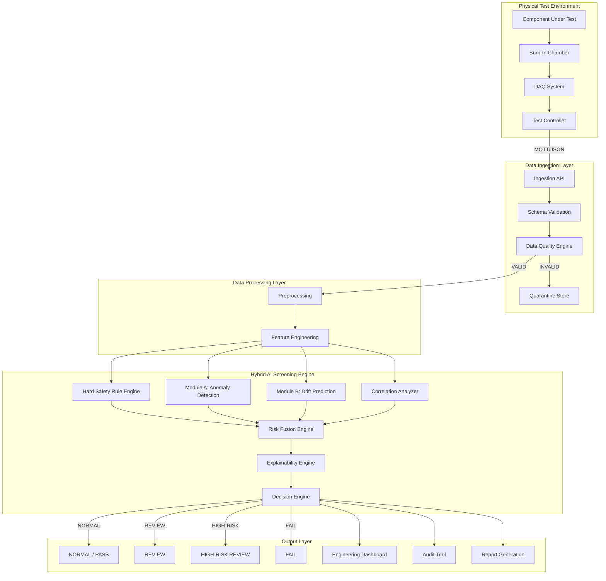
```mermaid
graph TD
    subgraph PHYSICAL[Physical Test Environment]
        CUT[Component Under Test]
        BIC[Burn-In Chamber]
        DAQ[DAQ System]
        TC[Test Controller]
        CUT --> BIC --> DAQ --> TC
    end
    subgraph INGESTION[Data Ingestion Layer]
        ING[Ingestion API]
        VAL[Schema Validation]
        DQE[Data Quality Engine]
        QUA[Quarantine Store]
        ING --> VAL --> DQE
        DQE -->|INVALID| QUA
    end
    subgraph PROCESSING[Data Processing Layer]
        PRE[Preprocessing]
        FEA[Feature Engineering]
        PRE --> FEA
    end
    subgraph AI[Hybrid AI Screening Engine]
        HSR[Hard Safety Rule Engine]
        MODA[Module A: Anomaly Detection]
        MODB[Module B: Drift Prediction]
        COR[Correlation Analyzer]
        RFE[Risk Fusion Engine]
        EXP[Explainability Engine]
        DEC[Decision Engine]
        HSR --> RFE
        MODA --> RFE
        MODB --> RFE
        COR --> RFE
        RFE --> EXP --> DEC
    end
    subgraph OUTPUT[Output Layer]
        PASS[NORMAL / PASS]
        REV[REVIEW]
        HRR[HIGH-RISK REVIEW]
        FAIL[FAIL]
        DASH[Engineering Dashboard]
        AUD[Audit Trail]
        RPT[Report Generation]
    end
    TC -->|MQTT/JSON| ING
    DQE -->|VALID| PRE
    FEA --> HSR
    FEA --> MODA
    FEA --> MODB
    FEA --> COR
    DEC -->|NORMAL| PASS
    DEC -->|REVIEW| REV
    DEC -->|HIGH-RISK| HRR
    DEC -->|FAIL| FAIL
    DEC --> DASH
    DEC --> AUD
    DEC --> RPT
```

### Diagram 2: Physical Test Environment

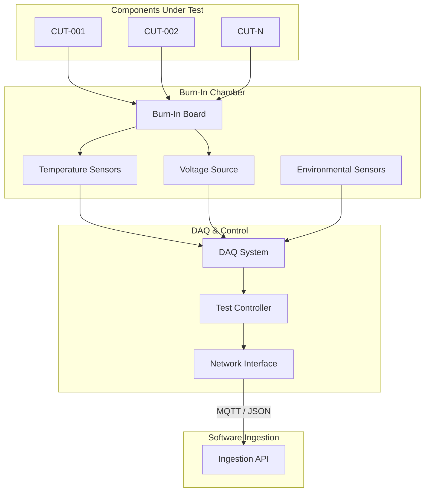
```mermaid
graph TD
    subgraph CUTS[Components Under Test]
        C1[CUT-001]
        C2[CUT-002]
        CN[CUT-N]
    end
    subgraph CHAMBER[Burn-In Chamber]
        BIB[Burn-In Board]
        TSENS[Temperature Sensors]
        VSRC[Voltage Source]
        ESENS[Environmental Sensors]
    end
    subgraph DAQ_LAYER[DAQ & Control]
        DAQ[DAQ System]
        TC[Test Controller]
        NI[Network Interface]
    end
    subgraph SW[Software Ingestion]
        ING[Ingestion API]
    end
    C1 & C2 & CN --> BIB
    BIB --> TSENS
    BIB --> VSRC
    TSENS --> DAQ
    VSRC --> DAQ
    ESENS --> DAQ
    DAQ --> TC --> NI
    NI -->|MQTT / JSON| ING
```

### Diagram 3: End-to-End Data Flow (Sequence)

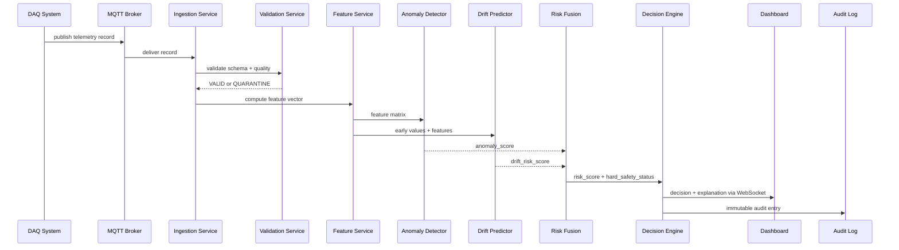
```mermaid
sequenceDiagram
    participant DAQ as DAQ System
    participant MQTT as MQTT Broker
    participant ING as Ingestion Service
    participant VAL as Validation Service
    participant FEA as Feature Service
    participant MODA as Anomaly Detector
    participant MODB as Drift Predictor
    participant RF as Risk Fusion
    participant DEC as Decision Engine
    participant DASH as Dashboard
    participant AUD as Audit Log

    DAQ->>MQTT: publish telemetry record
    MQTT->>ING: deliver record
    ING->>VAL: validate schema + quality
    VAL-->>ING: VALID or QUARANTINE
    ING->>FEA: compute feature vector
    FEA->>MODA: feature matrix
    FEA->>MODB: early values + features
    MODA-->>RF: anomaly_score
    MODB-->>RF: drift_risk_score
    RF->>DEC: risk_score + hard_safety_status
    DEC->>DASH: decision + explanation via WebSocket
    DEC->>AUD: immutable audit entry
```

### Diagram 4: AI/ML Pipeline

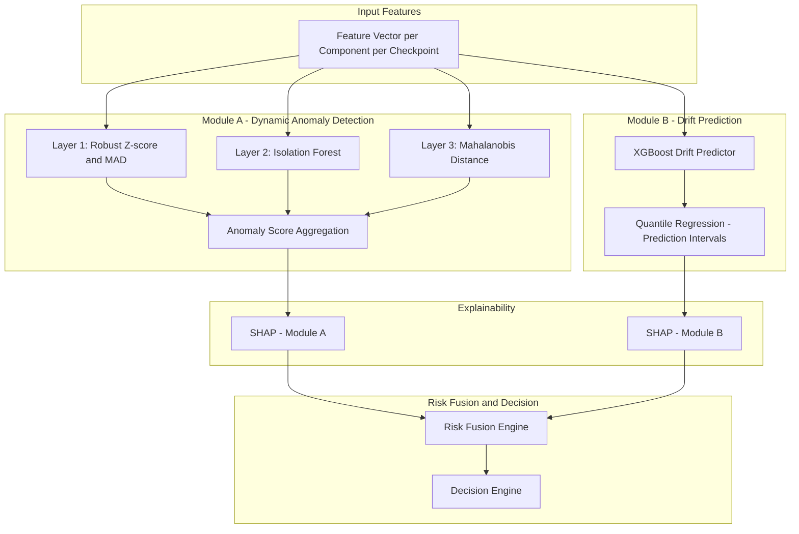
```mermaid
graph TD
    subgraph INPUTS[Input Features]
        FV[Feature Vector per Component per Checkpoint]
    end
    subgraph MODA[Module A - Dynamic Anomaly Detection]
        L1A[Layer 1: Robust Z-score and MAD]
        L1B[Layer 2: Isolation Forest]
        L1C[Layer 3: Mahalanobis Distance]
        AS[Anomaly Score Aggregation]
        L1A --> AS
        L1B --> AS
        L1C --> AS
    end
    subgraph MODB[Module B - Drift Prediction]
        DP[XGBoost Drift Predictor]
        PI[Quantile Regression - Prediction Intervals]
        DP --> PI
    end
    subgraph EXPLAIN[Explainability]
        SHAP_A[SHAP - Module A]
        SHAP_B[SHAP - Module B]
    end
    subgraph FUSION[Risk Fusion and Decision]
        RF[Risk Fusion Engine]
        DEC[Decision Engine]
        RF --> DEC
    end
    FV --> L1A & L1B & L1C
    FV --> DP
    AS --> SHAP_A --> RF
    PI --> SHAP_B --> RF
```

### Diagram 5: Hybrid Decision Engine

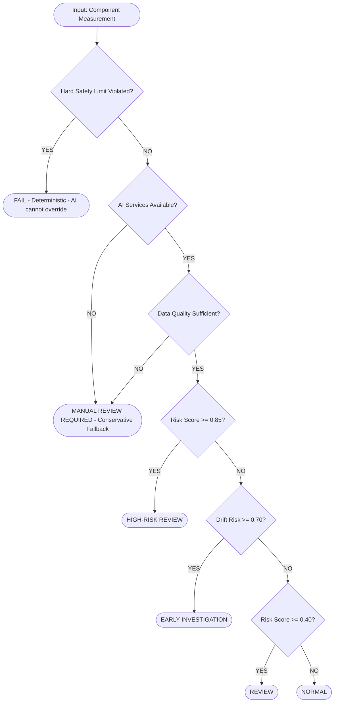
```mermaid
flowchart TD
    START([Input: Component Measurement]) --> HSR{Hard Safety Limit Violated?}
    HSR -->|YES| FAIL([FAIL - Deterministic - AI cannot override])
    HSR -->|NO| AI_OK{AI Services Available?}
    AI_OK -->|NO| MRR([MANUAL REVIEW REQUIRED - Conservative Fallback])
    AI_OK -->|YES| DQ{Data Quality Sufficient?}
    DQ -->|NO| MRR
    DQ -->|YES| RS{Risk Score >= 0.85?}
    RS -->|YES| HRR([HIGH-RISK REVIEW])
    RS -->|NO| DR{Drift Risk >= 0.70?}
    DR -->|YES| EI([EARLY INVESTIGATION])
    DR -->|NO| MS{Risk Score >= 0.40?}
    MS -->|YES| REV([REVIEW])
    MS -->|NO| NRM([NORMAL])
```

### Diagram 6: Dynamic Anomaly Detection — Module A

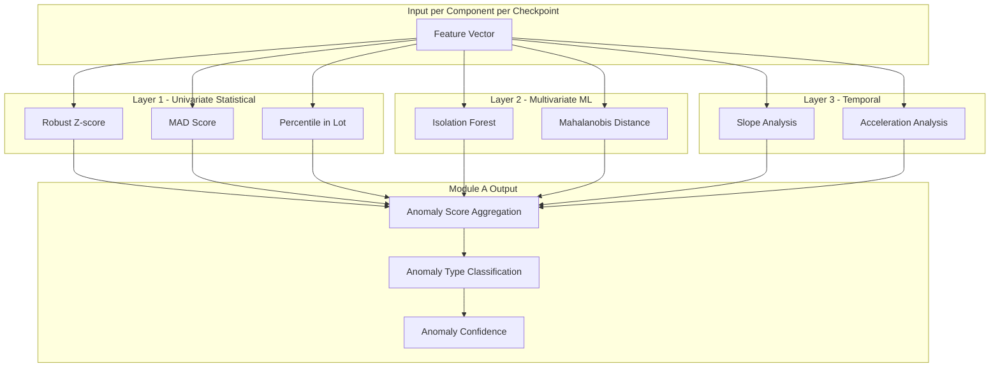
```mermaid
graph TD
    subgraph INPUT[Input per Component per Checkpoint]
        FV[Feature Vector]
    end
    subgraph LAYER1[Layer 1 - Univariate Statistical]
        ZS[Robust Z-score]
        MAD[MAD Score]
        PCT[Percentile in Lot]
    end
    subgraph LAYER2[Layer 2 - Multivariate ML]
        IF[Isolation Forest]
        MH[Mahalanobis Distance]
    end
    subgraph LAYER3[Layer 3 - Temporal]
        SLP[Slope Analysis]
        ACC[Acceleration Analysis]
    end
    subgraph OUTPUT[Module A Output]
        AGG[Anomaly Score Aggregation]
        ATYPE[Anomaly Type Classification]
        CONF[Anomaly Confidence]
    end
    FV --> ZS & MAD & PCT
    FV --> IF & MH
    FV --> SLP & ACC
    ZS & MAD & PCT --> AGG
    IF & MH --> AGG
    SLP & ACC --> AGG
    AGG --> ATYPE --> CONF
```

### Diagram 7: Drift Prediction — Module B

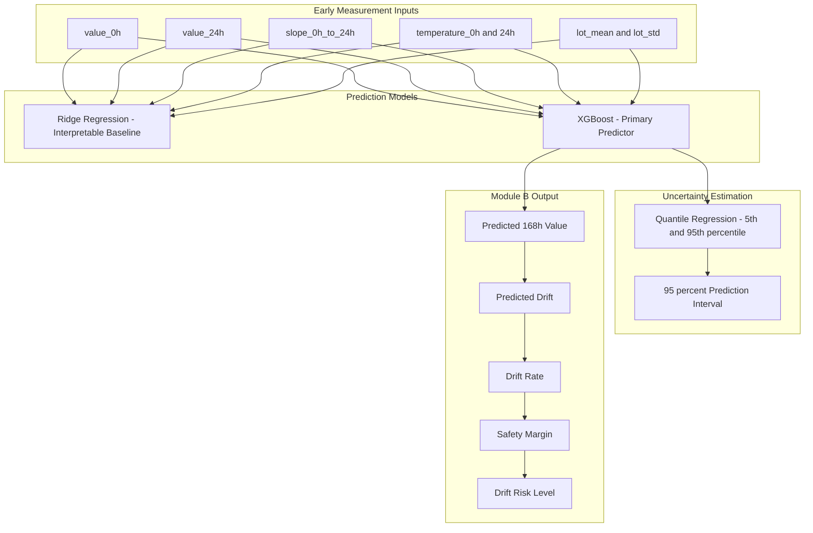
```mermaid
graph TD
    subgraph INPUTS[Early Measurement Inputs]
        V0[value_0h]
        V24[value_24h]
        SLP[slope_0h_to_24h]
        TEMP[temperature_0h and 24h]
        LSTATS[lot_mean and lot_std]
    end
    subgraph MODELS[Prediction Models]
        RIDGE[Ridge Regression - Interpretable Baseline]
        XGB[XGBoost - Primary Predictor]
    end
    subgraph UNCERTAINTY[Uncertainty Estimation]
        QR[Quantile Regression - 5th and 95th percentile]
        CI[95 percent Prediction Interval]
    end
    subgraph OUTPUT[Module B Output]
        P168[Predicted 168h Value]
        DRIFT[Predicted Drift]
        RATE[Drift Rate]
        MARGIN[Safety Margin]
        RISK[Drift Risk Level]
    end
    V0 & V24 & SLP & TEMP & LSTATS --> RIDGE
    V0 & V24 & SLP & TEMP & LSTATS --> XGB
    XGB --> QR --> CI
    XGB --> P168 --> DRIFT --> RATE --> MARGIN --> RISK
```

### Diagram 8: Risk Fusion Engine

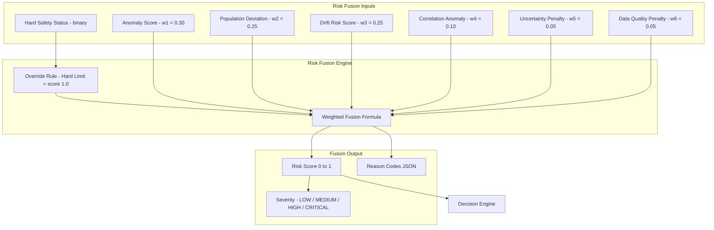
```mermaid
graph TD
    subgraph INPUTS[Risk Fusion Inputs]
        HSS[Hard Safety Status - binary]
        AS[Anomaly Score - w1 = 0.30]
        PD[Population Deviation - w2 = 0.25]
        DR[Drift Risk Score - w3 = 0.25]
        CA[Correlation Anomaly - w4 = 0.10]
        UC[Uncertainty Penalty - w5 = 0.05]
        DQ[Data Quality Penalty - w6 = 0.05]
    end
    subgraph ENGINE[Risk Fusion Engine]
        WF[Weighted Fusion Formula]
        OR[Override Rule - Hard Limit = score 1.0]
    end
    subgraph OUTPUT[Fusion Output]
        RS[Risk Score 0 to 1]
        SEV[Severity - LOW / MEDIUM / HIGH / CRITICAL]
        RC[Reason Codes JSON]
    end
    HSS --> OR --> WF
    AS & PD & DR & CA & UC & DQ --> WF
    WF --> RS --> SEV
    WF --> RC
    RS --> DEC[Decision Engine]
```

### Diagram 9: Explainability Pipeline

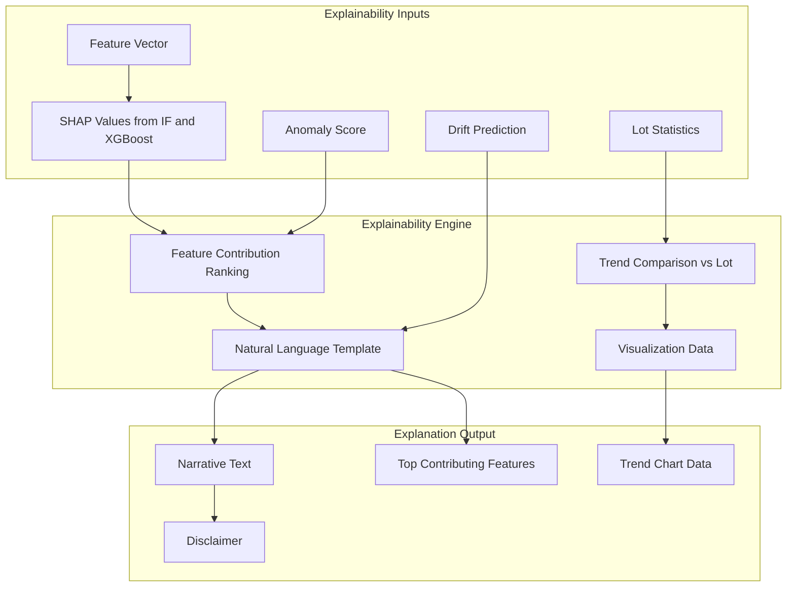
```mermaid
graph TD
    subgraph INPUTS[Explainability Inputs]
        FV[Feature Vector]
        AS[Anomaly Score]
        SHAP[SHAP Values from IF and XGBoost]
        PRED[Drift Prediction]
        LOT[Lot Statistics]
    end
    subgraph ENGINE[Explainability Engine]
        FC[Feature Contribution Ranking]
        NL[Natural Language Template]
        TC[Trend Comparison vs Lot]
        VIZ[Visualization Data]
    end
    subgraph OUTPUT[Explanation Output]
        NAR[Narrative Text]
        FEAT[Top Contributing Features]
        CHART[Trend Chart Data]
        DISC[Disclaimer]
    end
    FV --> SHAP --> FC --> NL --> NAR
    AS --> FC
    PRED --> NL
    LOT --> TC --> VIZ --> CHART
    NL --> FEAT
    NAR --> DISC
```

### Diagram 10: Database ER Diagram

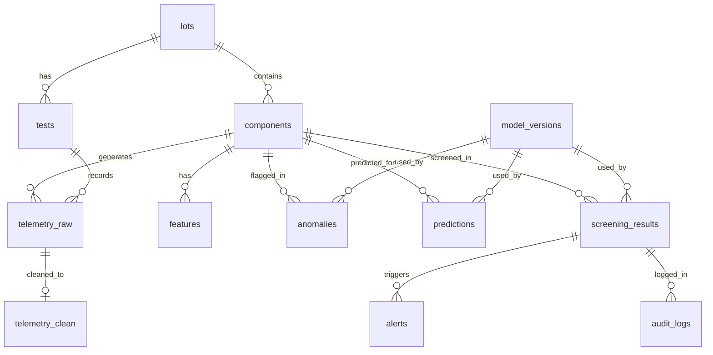
```mermaid
erDiagram
    lots ||--o{ components : contains
    lots ||--o{ tests : has
    components ||--o{ telemetry_raw : generates
    tests ||--o{ telemetry_raw : records
    telemetry_raw ||--o| telemetry_clean : cleaned_to
    components ||--o{ features : has
    components ||--o{ anomalies : flagged_in
    components ||--o{ predictions : predicted_for
    components ||--o{ screening_results : screened_in
    model_versions ||--o{ anomalies : used_by
    model_versions ||--o{ predictions : used_by
    model_versions ||--o{ screening_results : used_by
    screening_results ||--o{ alerts : triggers
    screening_results ||--o{ audit_logs : logged_in
```

### Diagram 11: REST API Architecture

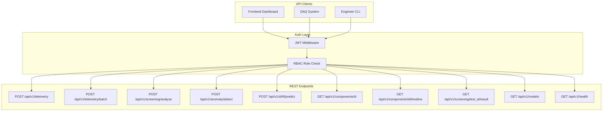
```mermaid
graph TD
    subgraph CLIENTS[API Clients]
        FE[Frontend Dashboard]
        DAQ[DAQ System]
        ENG[Engineer CLI]
    end
    subgraph AUTH[Auth Layer]
        JWT[JWT Middleware]
        RBAC[RBAC Role Check]
    end
    subgraph ENDPOINTS[REST Endpoints]
        E1[POST /api/v1/telemetry]
        E2[POST /api/v1/telemetry/batch]
        E3[POST /api/v1/screening/analyze]
        E4[POST /api/v1/anomaly/detect]
        E5[POST /api/v1/drift/predict]
        E6[GET /api/v1/components/id]
        E7[GET /api/v1/components/id/timeline]
        E8[GET /api/v1/screening/test_id/result]
        E9[GET /api/v1/models]
        E10[GET /api/v1/health]
    end
    FE & DAQ & ENG --> JWT --> RBAC
    RBAC --> E1 & E2 & E3 & E4 & E5
    RBAC --> E6 & E7 & E8 & E9 & E10
```

### Diagram 12: Real-Time Architecture

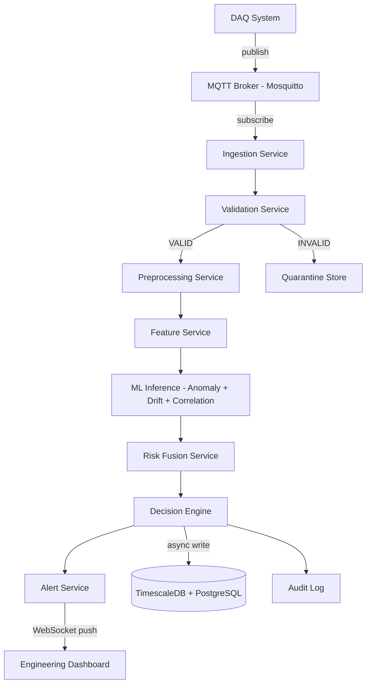
```mermaid
graph TD
    DAQ[DAQ System] -->|publish| MQTT[MQTT Broker - Mosquitto]
    MQTT -->|subscribe| ING[Ingestion Service]
    ING --> VAL[Validation Service]
    VAL -->|VALID| PRE[Preprocessing Service]
    VAL -->|INVALID| QUA[Quarantine Store]
    PRE --> FEA[Feature Service]
    FEA --> ML[ML Inference - Anomaly + Drift + Correlation]
    ML --> RF[Risk Fusion Service]
    RF --> DEC[Decision Engine]
    DEC --> ALS[Alert Service]
    ALS -->|WebSocket push| DASH[Engineering Dashboard]
    DEC -->|async write| DB[(TimescaleDB + PostgreSQL)]
    DEC --> AUD[Audit Log]
```

### Diagram 13: Batch Processing Architecture

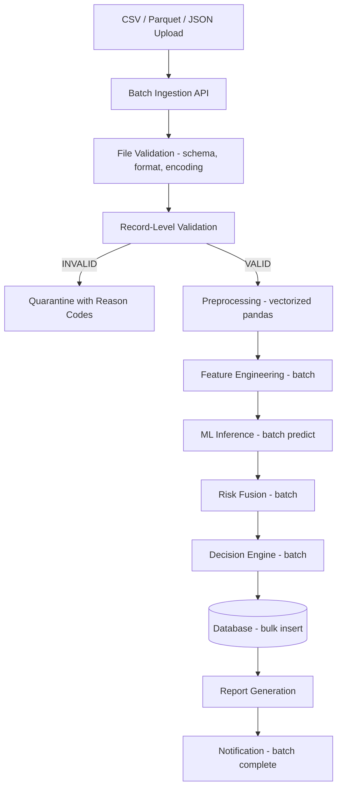
```mermaid
graph TD
    SRC[CSV / Parquet / JSON Upload] --> BAPI[Batch Ingestion API]
    BAPI --> FVAL[File Validation - schema, format, encoding]
    FVAL --> RVAL[Record-Level Validation]
    RVAL -->|INVALID| QUA[Quarantine with Reason Codes]
    RVAL -->|VALID| PRE[Preprocessing - vectorized pandas]
    PRE --> FEA[Feature Engineering - batch]
    FEA --> ML[ML Inference - batch predict]
    ML --> RF[Risk Fusion - batch]
    RF --> DEC[Decision Engine - batch]
    DEC --> DB[(Database - bulk insert)]
    DB --> RPT[Report Generation]
    RPT --> NOTIF[Notification - batch complete]
```

### Diagram 14: MLOps Lifecycle

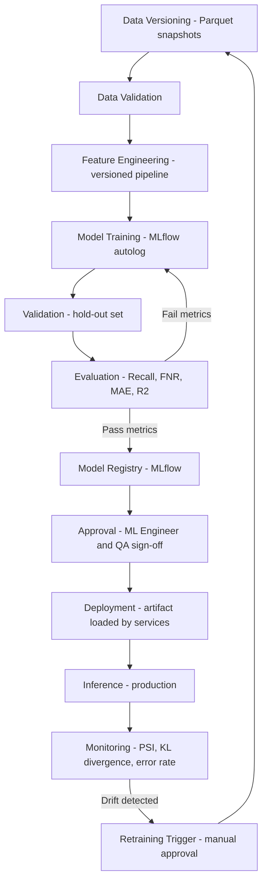
```mermaid
graph TD
    DV[Data Versioning - Parquet snapshots] --> DVL[Data Validation]
    DVL --> FE[Feature Engineering - versioned pipeline]
    FE --> TR[Model Training - MLflow autolog]
    TR --> VAL[Validation - hold-out set]
    VAL --> EVAL[Evaluation - Recall, FNR, MAE, R2]
    EVAL -->|Pass metrics| MR[Model Registry - MLflow]
    EVAL -->|Fail metrics| TR
    MR --> APR[Approval - ML Engineer and QA sign-off]
    APR --> DEP[Deployment - artifact loaded by services]
    DEP --> INF[Inference - production]
    INF --> MON[Monitoring - PSI, KL divergence, error rate]
    MON -->|Drift detected| RTR[Retraining Trigger - manual approval]
    RTR --> DV
```

### Diagram 15: Deployment Architecture — SIH Demo

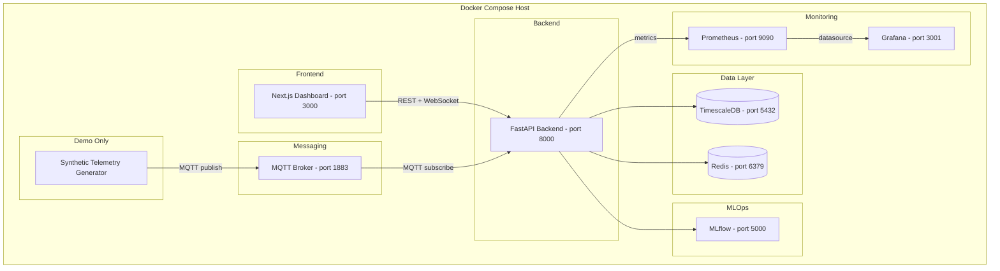
```mermaid
graph TD
    subgraph DC[Docker Compose Host]
        subgraph FRONTEND[Frontend]
            FE[Next.js Dashboard - port 3000]
        end
        subgraph BACKEND[Backend]
            BE[FastAPI Backend - port 8000]
        end
        subgraph DEMO[Demo Only]
            TG[Synthetic Telemetry Generator]
        end
        subgraph DATA[Data Layer]
            DB[(TimescaleDB - port 5432)]
            RD[(Redis - port 6379)]
        end
        subgraph MESSAGING[Messaging]
            MQ[MQTT Broker - port 1883]
        end
        subgraph MLOPS[MLOps]
            ML[MLflow - port 5000]
        end
        subgraph MONITORING[Monitoring]
            PR[Prometheus - port 9090]
            GR[Grafana - port 3001]
        end
    end
    FE -->|REST + WebSocket| BE
    BE --> DB
    BE --> RD
    BE --> ML
    TG -->|MQTT publish| MQ
    MQ -->|MQTT subscribe| BE
    BE -->|metrics| PR
    PR -->|datasource| GR
```

### Diagram 16: Production Deployment Architecture

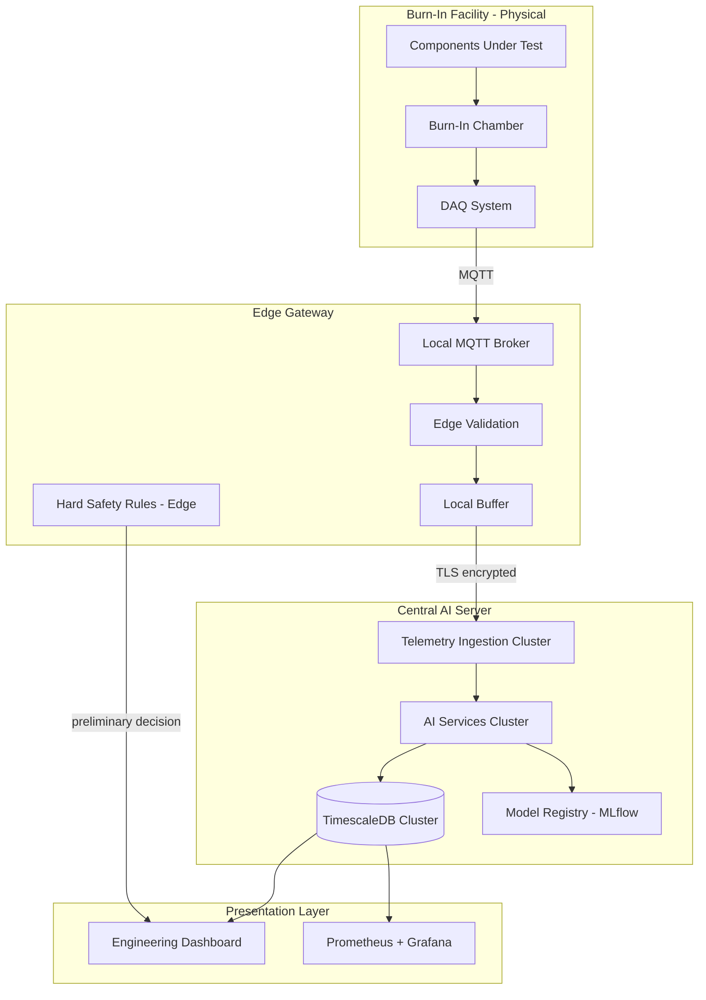
```mermaid
graph TD
    subgraph FACILITY[Burn-In Facility - Physical]
        CUT[Components Under Test]
        BIC[Burn-In Chamber]
        DAQ[DAQ System]
    end
    subgraph EDGE[Edge Gateway]
        EMQTT[Local MQTT Broker]
        EVAL[Edge Validation]
        EBUF[Local Buffer]
        EHARD[Hard Safety Rules - Edge]
    end
    subgraph SERVER[Central AI Server]
        ING[Telemetry Ingestion Cluster]
        AI[AI Services Cluster]
        DB[(TimescaleDB Cluster)]
        MR[Model Registry - MLflow]
    end
    subgraph PRESENTATION[Presentation Layer]
        DASH[Engineering Dashboard]
        MON[Prometheus + Grafana]
    end
    CUT --> BIC --> DAQ
    DAQ -->|MQTT| EMQTT --> EVAL --> EBUF
    EBUF -->|TLS encrypted| ING
    EHARD -->|preliminary decision| DASH
    ING --> AI --> DB
    AI --> MR
    DB --> DASH
    DB --> MON
```

### Diagram 17: Security Architecture

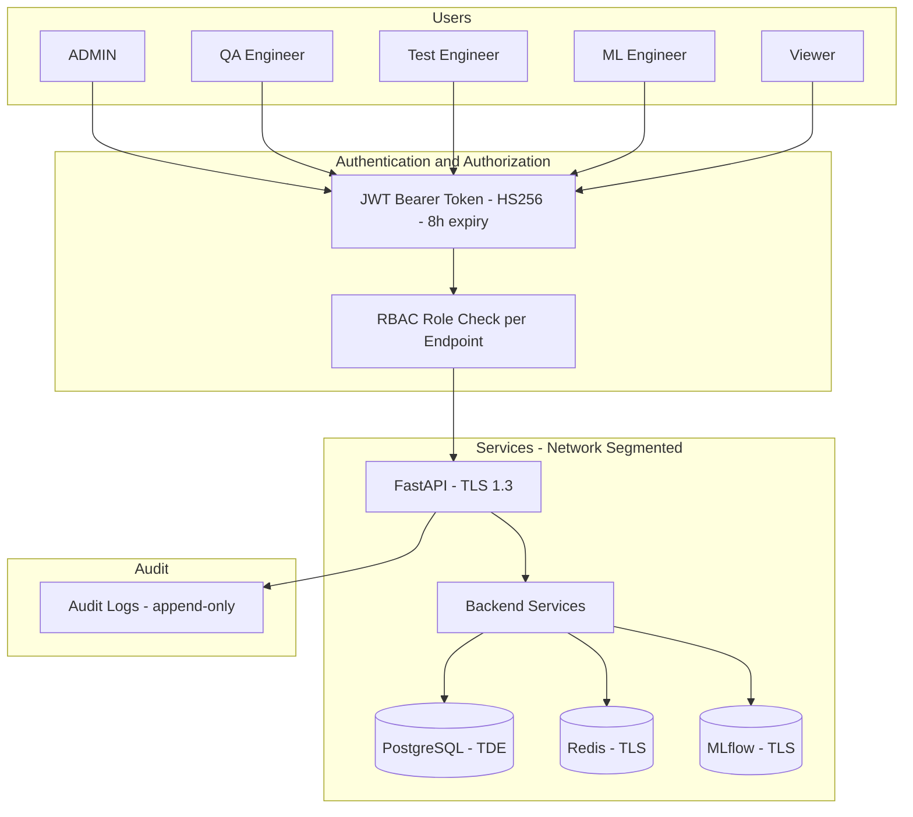
```mermaid
graph TD
    subgraph USERS[Users]
        ADMIN[ADMIN]
        QA[QA Engineer]
        TEST[Test Engineer]
        MLE[ML Engineer]
        VIEW[Viewer]
    end
    subgraph AUTH[Authentication and Authorization]
        JWT[JWT Bearer Token - HS256 - 8h expiry]
        RBAC[RBAC Role Check per Endpoint]
    end
    subgraph SERVICES[Services - Network Segmented]
        API[FastAPI - TLS 1.3]
        SVC[Backend Services]
        DB[(PostgreSQL - TDE)]
        RD[(Redis - TLS)]
        ML[(MLflow - TLS)]
    end
    subgraph AUDIT[Audit]
        AUD[Audit Logs - append-only]
    end
    ADMIN & QA & TEST & MLE & VIEW --> JWT --> RBAC
    RBAC --> API --> SVC
    SVC --> DB & RD & ML
    API --> AUD
```

### Diagram 18: Failure and Fallback Architecture

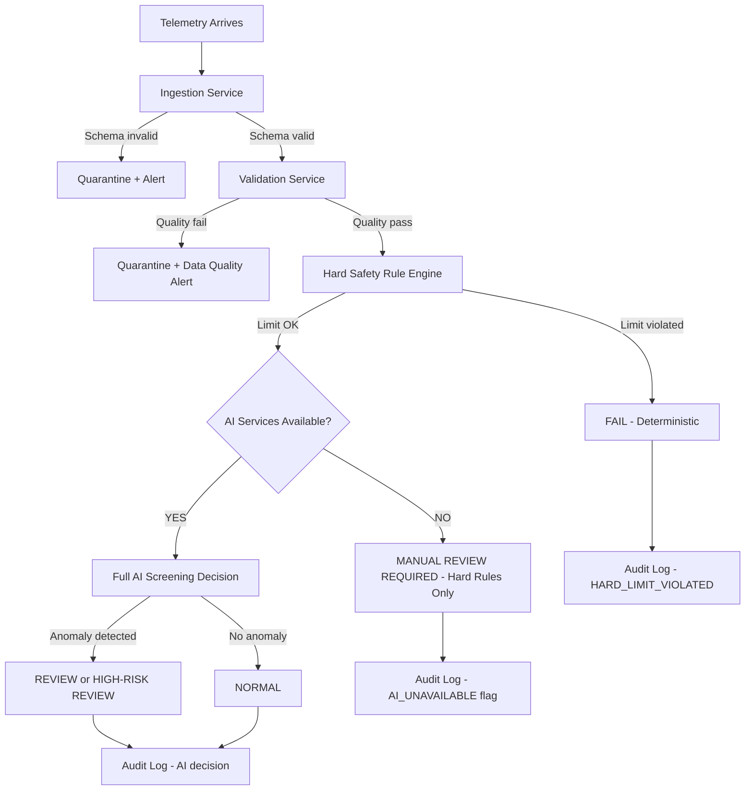
```mermaid
flowchart TD
    TEL[Telemetry Arrives] --> ING[Ingestion Service]
    ING -->|Schema invalid| QUA1[Quarantine + Alert]
    ING -->|Schema valid| VAL[Validation Service]
    VAL -->|Quality fail| QUA2[Quarantine + Data Quality Alert]
    VAL -->|Quality pass| HSR[Hard Safety Rule Engine]
    HSR -->|Limit violated| FAIL[FAIL - Deterministic]
    HSR -->|Limit OK| AI{AI Services Available?}
    AI -->|YES| FULL[Full AI Screening Decision]
    AI -->|NO| SAFE[MANUAL REVIEW REQUIRED - Hard Rules Only]
    FULL -->|Anomaly detected| FLAG[REVIEW or HIGH-RISK REVIEW]
    FULL -->|No anomaly| NORM[NORMAL]
    SAFE --> AUD1[Audit Log - AI_UNAVAILABLE flag]
    FAIL --> AUD2[Audit Log - HARD_LIMIT_VIOLATED]
    FLAG --> AUD3[Audit Log - AI decision]
    NORM --> AUD3
```

### Diagram 19: Auditability Trace Sequence

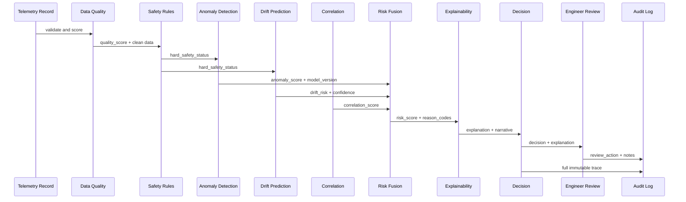
```mermaid
sequenceDiagram
    participant TEL as Telemetry Record
    participant DQ as Data Quality
    participant HSR as Safety Rules
    participant MODA as Anomaly Detection
    participant MODB as Drift Prediction
    participant COR as Correlation
    participant RF as Risk Fusion
    participant EXP as Explainability
    participant DEC as Decision
    participant ENG as Engineer Review
    participant AUD as Audit Log

    TEL->>DQ: validate and score
    DQ->>HSR: quality_score + clean data
    HSR->>MODA: hard_safety_status
    HSR->>MODB: hard_safety_status
    MODA->>RF: anomaly_score + model_version
    MODB->>RF: drift_risk + confidence
    COR->>RF: correlation_score
    RF->>EXP: risk_score + reason_codes
    EXP->>DEC: explanation + narrative
    DEC->>ENG: decision + explanation
    ENG->>AUD: review_action + notes
    DEC->>AUD: full immutable trace
```

### Diagram 20: Component Health Timeline

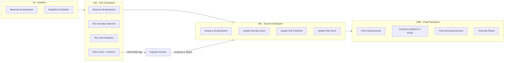
```mermaid
graph LR
    subgraph T0[0h - Baseline]
        M0[Measure all parameters]
        B0[Establish lot baseline]
    end
    subgraph T24[24h - First Checkpoint]
        M24[Measure all parameters]
        A24[Run Anomaly Detection]
        D24[Run Drift Prediction]
        R24[Risk Fusion + Decision]
    end
    subgraph T96[96h - Second Checkpoint]
        M96[Measure all parameters]
        A96[Update Anomaly Score]
        D96[Update Drift Prediction]
        R96[Update Risk Score]
    end
    subgraph T168[168h - Final Checkpoint]
        M168[Final measurements]
        COMP[Compare predicted vs actual]
        FINAL[Final Screening Decision]
        RPT[Generate Report]
    end
    T0 --> T24 --> T96 --> T168
    R24 -->|HIGH-RISK flag| ENG[Engineer Review]
    ENG -->|Continue or Reject| T96
```


---

## 40. TECHNOLOGY STACK & ARCHITECTURAL DECISIONS

### Technology Choices

| Layer | Technology | Justification | Alternative | Why Not Selected |
|---|---|---|---|---|
| Frontend | Next.js + TypeScript | SSR, type safety, React ecosystem | Vue.js, Angular | React ecosystem more mature for dashboards |
| UI Styling | Tailwind CSS | Utility-first, fast prototyping | Material UI | More flexible, less opinionated |
| Charts | ECharts / Recharts | Rich time-series support, performant | D3.js, Plotly | Lower-level D3 requires more code |
| Backend | FastAPI | Async, auto OpenAPI docs, Pydantic validation, Python ML ecosystem | Flask, Django | Flask lacks async; Django too heavy |
| Data Validation | Pydantic v2 | Fast, type-safe, integrates with FastAPI | Marshmallow | Pydantic v2 is faster and more Pythonic |
| Anomaly Detection | Isolation Forest + Robust Z-score | Unsupervised, small datasets, interpretable, fast | Autoencoder | Autoencoder needs more data, less interpretable |
| Drift Prediction | XGBoost + Ridge baseline | Non-linear drift, feature importance, fast | LSTM | Only 4 checkpoints — LSTM not justified |
| Explainability | SHAP | Model-agnostic, well-established, works with XGBoost/IF | LIME | SHAP more consistent, better for tree models |
| Primary Database | PostgreSQL + TimescaleDB | Relational integrity + time-series performance | MongoDB | Relational model better for audit trail and FK constraints |
| Time-Series | TimescaleDB | PostgreSQL extension, SQL interface, compression | InfluxDB | TimescaleDB keeps SQL interface, easier integration |
| Cache | Redis | Fast lot statistics cache, pub/sub | Memcached | Redis has richer data structures |
| Messaging | MQTT (prototype) / Kafka (production) | MQTT matches DAQ ecosystem; Kafka for scale | REST polling | Push model more efficient than polling |
| MLOps | MLflow | Open source, experiment tracking, model registry | Weights & Biases | MLflow self-hosted, no external dependency |
| Containerization | Docker + Docker Compose | Standard, reproducible, easy demo | Kubernetes | K8s overkill for SIH prototype |
| Monitoring | Prometheus + Grafana | Industry standard, open source | Datadog | Self-hosted, no cost |
| Tracing | OpenTelemetry | Vendor-neutral standard | Jaeger standalone | OTel is the standard |

### Key Architectural Decisions

**Decision 1: Why Isolation Forest over Autoencoder?**
- Dataset: Small (20–200 components per lot), unlabeled
- Isolation Forest: Works well on small tabular datasets, unsupervised, produces interpretable anomaly scores, computationally efficient
- Autoencoder: Requires larger datasets for meaningful reconstruction, less interpretable, adds PyTorch dependency without proportional benefit
- Trade-off: Isolation Forest may miss complex non-linear anomaly patterns that an Autoencoder could capture — acceptable for prototype, revisit with larger real datasets

**Decision 2: Why XGBoost over LSTM for drift prediction?**
- Data: 4 checkpoints per component (0h, 24h, 96h, 168h)
- XGBoost: Handles non-linear relationships, provides feature importance (used in SHAP), fast inference, works well with small datasets
- LSTM: Requires many time steps per sequence for meaningful temporal learning; 4 checkpoints is insufficient; adds complexity without benefit
- Trade-off: XGBoost cannot capture complex temporal dependencies — acceptable given 4-checkpoint constraint

**Decision 3: Why FastAPI over Flask?**
- FastAPI: Native async support (critical for real-time telemetry), automatic OpenAPI documentation, Pydantic integration, better performance
- Flask: Synchronous by default, no built-in validation, manual documentation
- Trade-off: FastAPI has steeper learning curve — acceptable given team Python expertise

**Decision 4: Why PostgreSQL/TimescaleDB over MongoDB?**
- PostgreSQL: ACID compliance, foreign key constraints, audit trail integrity, SQL for complex analytical queries
- TimescaleDB: Time-series optimized queries, automatic partitioning, compression — all as a PostgreSQL extension
- MongoDB: Document model less suited for relational audit trail; no native time-series optimization
- Trade-off: PostgreSQL schema is less flexible than MongoDB — acceptable given well-defined telemetry schema

**Decision 5: Why MQTT over direct REST streaming?**
- MQTT: Designed for IoT/DAQ, lightweight, pub/sub decouples DAQ from backend, handles intermittent connectivity
- REST polling: Higher latency, more bandwidth, tighter coupling
- Trade-off: MQTT requires broker infrastructure — acceptable, Mosquitto is lightweight

---

## 41. IMPLEMENTATION ROADMAP

### Phase 1: Synthetic Data Generator (Week 1)
- Deliverables: Python script generating realistic burn-in telemetry with configurable anomaly injection
- Dependencies: NumPy, Pandas
- Expected Output: CSV/JSON files with labeled synthetic data (NORMAL, GRADUAL_DRIFT, SUDDEN_SPIKE, etc.)
- Testing: Verify statistical properties match expected distributions

### Phase 2: Data Pipeline (Week 1–2)
- Deliverables: Ingestion API, validation service, preprocessing service, TimescaleDB schema, migrations
- Dependencies: Phase 1 data
- Expected Output: Clean telemetry stored in database; quarantine working
- Testing: Data quality rules tested with crafted bad records

### Phase 3: Dynamic Anomaly Detection — Module A (Week 2)
- Deliverables: Feature engineering, Isolation Forest + Z-score + Mahalanobis implementation, MLflow experiment tracking
- Dependencies: Phase 2 pipeline
- Expected Output: Anomaly scores on synthetic data; evaluation metrics on labeled synthetic set
- Testing: Recall > 0.80 on injected anomalies [ASSUMPTION — target]

### Phase 4: 168h Drift Prediction — Module B (Week 2–3)
- Deliverables: XGBoost drift predictor, quantile regression intervals, Ridge baseline
- Dependencies: Phase 2 pipeline
- Expected Output: Predicted 168h values with confidence intervals; MAE, RMSE, R² metrics
- Testing: R² > 0.85 on synthetic validation set [ASSUMPTION — target]

### Phase 5: Risk Fusion Engine (Week 3)
- Deliverables: Configurable risk fusion service, decision engine, reason code generation
- Dependencies: Phases 3, 4
- Expected Output: Risk scores and decisions for all test scenarios
- Testing: All 10 test scenarios produce expected decisions

### Phase 6: Explainability Engine (Week 3)
- Deliverables: SHAP integration, narrative template engine, explanation JSON schema
- Dependencies: Phases 3, 4, 5
- Expected Output: Engineer-readable explanations for all non-NORMAL decisions
- Testing: Explanation consistency check; qualitative review

### Phase 7: Backend APIs (Week 3–4)
- Deliverables: All REST endpoints, authentication, RBAC, audit logging
- Dependencies: Phases 2–6
- Expected Output: Fully functional API with OpenAPI documentation
- Testing: API tests for all endpoints; auth bypass tests; load test

### Phase 8: Engineering Dashboard (Week 4)
- Deliverables: Next.js dashboard with all 9 pages, real-time WebSocket updates
- Dependencies: Phase 7 API
- Expected Output: Functional dashboard showing live screening status
- Testing: E2E tests; UI review with engineering clarity criteria

### Phase 9: MLOps Pipeline (Week 4–5)
- Deliverables: MLflow integration, model registry, retraining scripts, drift monitoring
- Dependencies: Phases 3, 4
- Expected Output: Reproducible training pipeline; model versioning working
- Testing: Model regression tests; rollback test

### Phase 10: Testing & SIH Demo (Week 5)
- Deliverables: Full test suite, demo script, Docker Compose demo deployment, documentation
- Dependencies: All phases
- Expected Output: SIH-ready demo; all test scenarios passing
- Testing: Full E2E demo run; jury Q&A preparation

---

## 42. SIH DEMO FLOW (2–3 minutes)

**Objective**: Clearly demonstrate the difference between static limit checking and AI-assisted behavioural screening.

**Step 1** (0:00–0:20): Upload/select a synthetic burn-in lot
- Show lot selection screen
- Display lot of 50 components loading

**Step 2** (0:20–0:40): Display normal population
- Show lot analytics page
- Box plot of leakage current distribution
- Most components clustered around 10 µA

**Step 3** (0:40–1:00): Show a component that passes hard limits
- Select component CUT-LOT42-007
- Show: Ileak = 45.2 µA, Absolute Limit = 50 µA
- Traditional result: **PASS** ✓
- Highlight: "Traditional threshold checking says PASS"

**Step 4** (1:00–1:20): AI identifies it as a lot-relative anomaly
- Show anomaly detection result
- Robust Z-score = 3.52 (3.5 sigma from lot median)
- Percentile in lot = 98.5%
- Anomaly score = 0.73
- AI result: **FLAG FOR INVESTIGATION**
- Highlight: "AI sees this component is 4.5× the lot median"

**Step 5** (1:20–1:40): Show temporal trend
- Show parameter timeline chart: 11.2 µA → 45.2 µA (0h to 24h)
- Continuous increasing trend
- Compare with lot median trend (flat ~10 µA)

**Step 6** (1:40–2:00): Predict 168h value
- Show drift prediction: predicted 168h = 38.7 µA
- 95% CI: 32.1–45.3 µA
- Safety margin: 22.6% from limit
- Drift rate: 0.163 µA/hour

**Step 7** (2:00–2:15): Show drift risk
- Risk score: 0.68 → HIGH-RISK REVIEW
- Reason codes displayed

**Step 8** (2:15–2:30): Generate explanation
- Show full explanation narrative
- SHAP feature contribution chart
- "Leakage current remained below the absolute limit but deviated substantially from the lot median..."

**Step 9** (2:30–2:45): Show final engineering recommendation
- Decision: HIGH-RISK REVIEW
- Disclaimer shown prominently
- Engineer review action panel

**Step 10** (2:45–3:00): Open audit trail
- Show complete decision trace
- Every step logged with timestamp and model version
- Demonstrate reproducibility

**Key Message**: "The component passed the traditional threshold check. The AI system identified it as a population outlier with an accelerating drift trajectory. This is the difference between static limit checking and dynamic behavioural screening."

---

## 43. JURY-LEVEL TECHNICAL DEFENSE

**Q: Why is AI required? Can't engineers just look at the data?**
A: Engineers can review data manually, but a typical burn-in lot has 50–200 components, each with 5–7 parameters measured at 4 checkpoints — that is 1,000–5,600 data points per lot. Manual review of all parameter trends and population comparisons is impractical at scale. The AI system automates population-relative comparison and drift trend analysis, flagging the specific components that warrant engineer attention. The engineer's expertise is then focused where it matters most.

**Q: Why are static thresholds insufficient?**
A: Static thresholds check whether a value exceeds a fixed limit. They cannot detect: (1) a component that is 4.5× the lot average but still below the limit; (2) a component with an accelerating drift trajectory that will approach the limit after deployment; (3) abnormal combinations of parameters where each is individually within limits. These are exactly the patterns associated with latent defects and infant mortality failures.

**Q: How do you detect latent defects?**
A: We do not claim guaranteed detection of latent defects — that would be scientifically indefensible. The system detects statistical anomalies in burn-in telemetry that are associated with abnormal component behaviour. Whether a specific anomaly corresponds to a latent defect requires engineering judgment and, ultimately, validation on real hardware with known failure outcomes.

**Q: How do you prevent false negatives (missed defective components)?**
A: The system is explicitly tuned to minimize false negatives at the cost of higher false positive rate. The contamination parameter in Isolation Forest, the risk score thresholds, and the decision precedence rules are all calibrated conservatively. False negative rate is reported explicitly in model evaluation. Additionally, the hard safety rule engine provides a deterministic safety net for limit violations. We acknowledge that no system can guarantee zero false negatives.

**Q: Why Isolation Forest and not an Autoencoder?**
A: Isolation Forest is better suited for this problem because: (1) lot sizes are small (20–200 components), insufficient for training a meaningful Autoencoder; (2) Isolation Forest is interpretable — anomaly scores can be explained via SHAP; (3) it is computationally efficient for real-time inference; (4) it works well on tabular data without requiring deep learning infrastructure. An Autoencoder would add complexity without proportional benefit given the dataset size and interpretability requirement.

**Q: Why XGBoost and not LSTM for drift prediction?**
A: Each component has only 4 measurement checkpoints (0h, 24h, 96h, 168h). LSTM requires many time steps per sequence to learn meaningful temporal patterns — 4 steps is insufficient. XGBoost handles non-linear drift patterns effectively, provides feature importance for explainability, and is computationally efficient. If future deployments include higher-frequency measurements (e.g., hourly), temporal models would be reconsidered.

**Q: How do you handle synthetic data? Isn't it unreliable?**
A: Synthetic data is used for prototype development and methodology validation only. It is clearly labeled as SYNTHETIC throughout the system. We use physics-informed simulation (Arrhenius-inspired degradation models) to generate realistic drift patterns. We explicitly state that synthetic validation results do NOT constitute real-world ISRO hardware validation. The system requires validation on real burn-in telemetry before operational deployment. This is a standard approach in ML system development when real data is unavailable.

**Q: How do you validate the model on real hardware?**
A: The validation strategy for real hardware would be: (1) collect burn-in telemetry from a defined lot with known outcomes (components that subsequently failed in service vs. those that did not); (2) use this labeled dataset to evaluate Recall, Precision, FNR, and PR-AUC; (3) calibrate risk thresholds and fusion weights on this validated dataset; (4) conduct a prospective validation study before operational deployment. This is future work beyond the SIH prototype scope.

**Q: How do you explain an anomaly to an engineer?**
A: Every non-NORMAL decision generates a structured explanation containing: the observed value, the lot median, the deviation in sigma units, the temporal trend, the predicted 168h value with confidence interval, the top contributing features ranked by SHAP value, and a natural language narrative. The explanation cites specific evidence and never claims causality. Example: "Leakage current remained below the absolute limit but deviated substantially from the lot median, corresponding to a robust Z-score of 3.52, with a continuous increasing trend from 11.2 µA at 0h to 45.2 µA at 24h."

**Q: What happens if the AI system fails?**
A: The system is designed with a mandatory fail-safe principle: AI failure must never result in a silent dangerous PASS. If any AI service is unavailable, the decision engine returns MANUAL_REVIEW_REQUIRED. Hard safety rules execute independently of AI services and always take precedence. All failures are logged to the audit trail. The system fails loudly, not silently.

**Q: Can AI override mandatory safety limits?**
A: No. This is a hard architectural constraint. The hard safety rule engine executes first and independently. If a mandatory limit is violated, the decision is FAIL regardless of the AI anomaly score. The AI layer can only add flags (REVIEW, HIGH-RISK REVIEW) to components that pass hard limits. It cannot remove a FAIL decision produced by the safety rule engine.

**Q: How will this scale to real telemetry volumes?**
A: The architecture is designed for horizontal scalability. The ingestion, preprocessing, and inference services are stateless and can be scaled independently. For high-volume production, MQTT is replaced by Kafka (already designed for in the architecture). TimescaleDB handles time-series at scale with automatic partitioning and compression. The SIH prototype uses Docker Compose; production deployment uses a container orchestration platform.

**Q: What happens when component types differ across lots?**
A: The anomaly detector is trained per component type (and per lot where lot size permits). Lot-level statistics are computed separately per component type. The feature engineering includes component_type as an encoded feature. Cross-type comparison is not performed — a CMOS logic IC is not compared against a bipolar transistor.

**Q: How do you handle lot-to-lot variation?**
A: Lot-to-lot variation is handled by computing all population statistics (mean, median, MAD, percentiles) within each lot independently. The robust Z-score uses the lot's own median and MAD, not a global baseline. This means a component is flagged as anomalous relative to its own lot, not relative to a historical global average. This is the correct approach for lot-relative screening.

**Q: How do you prevent data leakage in model training?**
A: For drift prediction, the model is trained to predict value_168h from value_0h and value_24h only. The 96h and 168h values are never used as input features. Lot-level statistics used as features are computed on the training set only and applied to the test set — they are not recomputed on the test set. Train/test splits are performed at the lot level (not component level) to prevent information leakage between components in the same lot.

**Q: How do you monitor model drift in production?**
A: Input feature distributions are monitored using Population Stability Index (PSI) and KL divergence, compared against the training distribution. When PSI > 0.2 (configurable threshold), an alert is generated and predictions are flagged as POTENTIALLY_DEGRADED. Model output distributions (anomaly score distribution, prediction error on labeled samples) are also monitored. Retraining is triggered manually after engineer approval — not automatically.

---

## 44. LIMITATIONS & FUTURE SCOPE

### Current Limitations

1. **[SYNTHETIC DATA ONLY]**: All prototype validation uses synthetic data. Real-world performance is unknown until validated on real ISRO burn-in telemetry.
2. **Small lot sizes**: Statistical methods require minimum lot size (~10 components) for meaningful population comparison. Very small lots reduce detection power.
3. **4-checkpoint constraint**: Drift prediction uses only 4 checkpoints. Higher-frequency measurements would enable better temporal models.
4. **No physics model integration**: The system uses statistical/ML methods. Integration with physics-of-failure models (Arrhenius, Black's equation) would improve prediction accuracy.
5. **Threshold calibration**: All risk thresholds and fusion weights are prototype defaults. They require calibration on validated real data before operational use.
6. **No functional test integration**: The system analyzes parametric measurements only. Functional test results are not currently integrated.
7. **Single-parameter drift prediction**: Module B predicts one parameter at a time. Joint multi-parameter drift prediction is future work.

### Future Scope

1. Integration with real ISRO burn-in telemetry and validation study
2. Physics-of-failure model integration for improved drift prediction
3. Higher-frequency telemetry support (hourly measurements) enabling temporal neural models
4. Multi-parameter joint drift prediction
5. Automated threshold calibration using validated historical data
6. Integration with functional test results
7. Radiation effects correlation (for space-grade components)
8. Federated learning across multiple burn-in facilities
9. Digital twin integration for component-level simulation
10. Formal safety case documentation for operational deployment

---

## 45. CONCLUSION

This document describes a complete, production-oriented system architecture for AI-assisted anomaly detection in component burn-in and environmental stress screening. The system is designed around three core principles:

1. **Safety First**: Hard safety rules always take precedence. AI cannot override mandatory engineering limits. AI failure never results in a silent PASS.

2. **Explainability**: Every non-NORMAL decision is accompanied by an engineer-readable explanation citing specific evidence. The system augments engineer judgment; it does not replace it.

3. **Auditability**: Every decision has a complete, immutable audit trail. The system supports full decision reproducibility.

The key innovation is the clear distinction between three fundamentally different screening concepts:

```
STATIC SAFETY LIMIT CHECK
    "Does the value exceed the absolute datasheet limit?"
    → Deterministic, mandatory, always executes

        ≠

DYNAMIC BEHAVIOURAL ANOMALY DETECTION
    "Is this component behaving abnormally relative to its lot population?"
    → Statistical/ML, population-relative, assistive

        ≠

FUTURE DRIFT RISK PREDICTION
    "Based on early measurements, is this component likely to approach
     its limit before the end of burn-in?"
    → Predictive, uncertainty-quantified, assistive
```

The combination of all three in a single auditable engineering workflow — with deterministic safety precedence, AI-assisted behavioural screening, and predictive drift analysis — represents a meaningful advancement over traditional fixed-threshold screening.

**[FINAL DISCLAIMER]**: This is a prototype system developed for Smart India Hackathon. It requires validation on real ISRO burn-in telemetry, calibration of all thresholds and weights by qualified engineers, and formal safety case review before any operational deployment. All AI outputs are advisory. The qualified engineer makes all final component disposition decisions.

---

*Document Version: 1.0.0*
*Project: SIH26170*
*Organization: ISRO (Problem Statement)*
*Prepared for: Smart India Hackathon Technical Presentation*
*Data Classification: Prototype / Research*
*All synthetic data clearly labeled as SYNTHETIC throughout*

---

# LOW-LEVEL DESIGN (LLD)
# SIH26170 — AI-Driven Anomaly Detection in Component Burn-In & Screening

---

## LLD TABLE OF CONTENTS

1. LLD-01: Telemetry Record Schema (Field-Level)
2. LLD-02: Data Quality Engine — Rule Definitions
3. LLD-03: Feature Engineering — Computation Logic
4. LLD-04: Module A — Anomaly Detection Algorithm Flow
5. LLD-05: Module B — Drift Prediction Algorithm Flow
6. LLD-06: Correlation Analyzer — Algorithm Flow
7. LLD-07: Risk Fusion Engine — Formula Detail
8. LLD-08: Decision Engine — Precedence Logic
9. LLD-09: Explainability Engine — Output Construction
10. LLD-10: Ingestion Service — Internal Flow
11. LLD-11: API Request/Response Contracts (Field-Level)
12. LLD-12: Database Table Definitions (Column-Level)
13. LLD-13: Redis Cache Schema
14. LLD-14: MQTT Topic Structure
15. LLD-15: MLflow Experiment and Run Schema
16. LLD-16: Alert Schema and Routing Logic
17. LLD-17: Audit Log Entry Schema
18. LLD-18: Report Template Structure
19. LLD-19: Fail-Safe State Machine
20. LLD-20: LLD Mermaid Diagrams

---

## LLD-01: TELEMETRY RECORD SCHEMA (FIELD-LEVEL)

Every telemetry record entering the system must conform to this schema.

| Field | Type | Required | Validation | Description |
|---|---|---|---|---|
| component_id | string | YES | regex: `^[A-Z0-9\-]{4,64}$` | Unique component identifier |
| test_id | string | YES | regex: `^[A-Z0-9\-]{4,64}$` | Test session identifier |
| lot_id | string | YES | regex: `^[A-Z0-9\-]{4,64}$` | Lot identifier |
| parameter | string | YES | enum: see Parameter Registry | Parameter name |
| value | float | YES | finite, not NaN, not Inf | Measured value |
| unit | string | YES | enum: uA, mA, ns, ps, V, mV, degC | Unit of measurement |
| timestamp | ISO8601 string | YES | not future, not > 30 days old | Measurement timestamp (UTC) |
| test_stage | string | YES | enum: 0h, 24h, 96h, 168h, intermediate | Burn-in checkpoint |
| temperature | float | NO | -55.0 to 200.0 degC | Chamber temperature |
| voltage | float | NO | 0.0 to 20.0 V | Applied voltage |
| operating_condition | string | NO | enum: burn_in_stress, ambient, post_burnin | Test condition |
| sensor_id | string | NO | max 64 chars | DAQ channel identifier |
| data_quality_flag | string | AUTO | enum: VALID, QUARANTINE, SUSPECT | Set by ingestion pipeline |

### Parameter Registry

| Parameter Name | Unit | Physical Min | Physical Max | Description |
|---|---|---|---|---|
| leakage_current | uA | 0.0 | 10000.0 | Leakage current Ileak |
| standby_current | mA | 0.0 | 1000.0 | Standby current Icc |
| propagation_delay | ns | 0.0 | 10000.0 | Propagation delay tpd |
| output_voltage_high | V | 0.0 | 20.0 | Output high voltage Voh |
| output_voltage_low | V | 0.0 | 20.0 | Output low voltage Vol |
| input_threshold_high | V | 0.0 | 20.0 | Input high threshold Vih |
| input_threshold_low | V | 0.0 | 20.0 | Input low threshold Vil |
| temperature | degC | -55.0 | 200.0 | Junction/chamber temperature |

---

## LLD-02: DATA QUALITY ENGINE — RULE DEFINITIONS

The Data Quality Engine applies the following rules in order. First failing rule quarantines the record.

| Rule ID | Rule Name | Condition | Action | Severity |
|---|---|---|---|---|
| DQ-01 | Missing Required Field | Any required field is null or absent | QUARANTINE | CRITICAL |
| DQ-02 | Invalid Parameter Name | parameter not in Parameter Registry | QUARANTINE | HIGH |
| DQ-03 | Physical Bounds Violation | value < physical_min OR value > physical_max | QUARANTINE | HIGH |
| DQ-04 | Future Timestamp | timestamp > now() + 60s | QUARANTINE | HIGH |
| DQ-05 | Stale Timestamp | timestamp < now() - 30 days | QUARANTINE | MEDIUM |
| DQ-06 | Duplicate Record | (component_id, parameter, timestamp) already exists | DEDUPLICATE + LOG | LOW |
| DQ-07 | Unit Mismatch | unit not matching parameter's expected unit | ATTEMPT CONVERSION, else QUARANTINE | MEDIUM |
| DQ-08 | Stuck Sensor | Same value for >= 5 consecutive readings on same sensor_id | FLAG as SUSPECT + ALERT | HIGH |
| DQ-09 | Missing Checkpoint | Component has no record for a checkpoint within ±30min window | FLAG as INCOMPLETE | MEDIUM |
| DQ-10 | Excessive Missing | > 20% of parameters missing for a component at a checkpoint | BLOCK ML INFERENCE | HIGH |

### Quality Score Computation

```
quality_score = 1.0
  - 0.3 if DQ-08 triggered (stuck sensor)
  - 0.2 if DQ-09 triggered (missing checkpoint)
  - 0.1 per missing optional field (max 0.2)
  - 0.4 if DQ-10 triggered (excessive missing)

quality_score = max(0.0, quality_score)
ML inference blocked if quality_score < 0.7  [ASSUMPTION — configurable]
```

---

## LLD-03: FEATURE ENGINEERING — COMPUTATION LOGIC

All features are computed per (component_id, test_id, parameter, checkpoint).

### F-01: raw_value
```
raw_value = telemetry_clean.value_normalized
            at (component_id, parameter, checkpoint)
```

### F-02: moving_avg_3pt
```
checkpoints_available = [v for v in [v_0h, v_24h, v_96h] if not null]
moving_avg_3pt = mean(checkpoints_available[-3:])
```

### F-03: rolling_std
```
rolling_std = std(checkpoints_available[-3:])
              returns null if < 2 values available
```

### F-04: slope_0h_to_now
```
slope_0h_to_now = (value_now - value_0h) / hours_elapsed
hours_elapsed = {24h: 24, 96h: 96, 168h: 168}
returns null if value_0h is null
```

### F-05: rate_of_change
```
rate_of_change = (value_current - value_previous) / delta_hours
delta_hours = hours between current and previous checkpoint
returns null if previous checkpoint unavailable
```

### F-06: acceleration
```
roc_current  = rate_of_change at current checkpoint
roc_previous = rate_of_change at previous checkpoint
acceleration = (roc_current - roc_previous) / delta_hours
returns null if < 3 checkpoints available
```

### F-07: deviation_from_lot_mean
```
lot_mean = mean(value for all components in lot at same parameter, checkpoint)
deviation_from_lot_mean = raw_value - lot_mean
```

### F-08: deviation_from_lot_median
```
lot_median = median(value for all components in lot at same parameter, checkpoint)
deviation_from_lot_median = raw_value - lot_median
```

### F-09: robust_z_score
```
lot_median = median(lot values)
MAD = median(|v - lot_median| for v in lot values)
robust_z_score = (raw_value - lot_median) / (1.4826 * MAD)
returns null if MAD == 0 (all lot values identical)
[1.4826 is the consistency factor for normal distribution]
```

### F-10: percentile_in_lot
```
percentile_in_lot = percentileofscore(lot_values, raw_value, kind='rank')
range: 0.0 to 100.0
```

### F-11: temp_normalized_value
```
alpha = parameter_temperature_coefficient  [ASSUMPTION — parameter-specific]
T_ref = 25.0  [reference temperature in degC]
temp_normalized_value = raw_value / (1 + alpha * (temperature - T_ref))
returns raw_value if temperature is null or alpha is undefined
```

### F-12: value_range_0h_to_now
```
value_range_0h_to_now = max(available_values) - min(available_values)
```

### F-13: trend_direction
```
if slope_0h_to_now > +epsilon:  trend_direction = +1  (increasing)
if slope_0h_to_now < -epsilon:  trend_direction = -1  (decreasing)
else:                           trend_direction =  0  (stable)
epsilon = 0.001 * lot_median  [ASSUMPTION — relative threshold]
```

### Lot Statistics (cached in Redis, TTL = 1 hour)
```
key: lot_stats:{lot_id}:{parameter}:{checkpoint}
value: {
  mean, median, std, mad,
  min, max,
  p5, p25, p75, p95,
  iqr, n_components
}
```

---

## LLD-04: MODULE A — ANOMALY DETECTION ALGORITHM FLOW

```
INPUT: feature_vector (F-01 through F-13) for one component at one checkpoint

STEP 1 — Univariate Statistical Layer
  robust_z = F-09 (robust_z_score)
  pct      = F-10 (percentile_in_lot)

  stat_anomaly_flag = (abs(robust_z) > Z_THRESHOLD)  [default Z_THRESHOLD=3.0, configurable]
  stat_score = min(1.0, abs(robust_z) / 5.0)         [normalize to 0-1]

STEP 2 — Isolation Forest Layer
  model = load_production_model('isolation_forest', component_type, lot_id)
  IF model not available for lot:
      model = load_production_model('isolation_forest', component_type)  [type-level fallback]
  IF model not available:
      isolation_score = null  [flag as MODEL_UNAVAILABLE]
  ELSE:
      raw_if_score = model.decision_function([feature_vector])
      isolation_score = normalize_if_score(raw_if_score)  [map to 0-1, higher = more anomalous]

STEP 3 — Mahalanobis Distance Layer
  cov_matrix = lot_covariance_matrix(lot_id, checkpoint)  [from Redis cache]
  IF cov_matrix not available OR n_components < 10:
      mahal_score = null
  ELSE:
      mahal_dist = mahalanobis(feature_vector, lot_mean_vector, inv(cov_matrix))
      mahal_score = chi2_pvalue_to_score(mahal_dist, df=n_features)

STEP 4 — Temporal Anomaly Layer
  slope     = F-04 (slope_0h_to_now)
  accel     = F-06 (acceleration)
  temporal_score = 0.0
  IF abs(slope) > SLOPE_THRESHOLD:     temporal_score += 0.4
  IF accel > ACCEL_THRESHOLD:          temporal_score += 0.3
  IF trend_direction changes sign:     temporal_score += 0.3
  temporal_score = min(1.0, temporal_score)

STEP 5 — Score Aggregation
  available_scores = [s for s in [stat_score, isolation_score, mahal_score, temporal_score]
                      if s is not null]
  IF len(available_scores) == 0:
      anomaly_score = null
      anomaly_type  = 'DETECTION_UNAVAILABLE'
  ELSE:
      weights = [0.25, 0.35, 0.25, 0.15]  [stat, IF, mahal, temporal — configurable]
      anomaly_score = weighted_average(available_scores, weights)

STEP 6 — Anomaly Type Classification
  IF mahal_score > MAHAL_THRESHOLD:    anomaly_type = 'MULTIVARIATE'
  ELIF temporal_score > 0.6:           anomaly_type = 'TEMPORAL'
  ELIF stat_score > 0.6:               anomaly_type = 'POPULATION_OUTLIER'
  ELSE:                                anomaly_type = 'COMPOSITE'

OUTPUT:
  anomaly_score        [0.0 - 1.0]
  population_deviation [robust_z_score]
  anomaly_confidence   [fraction of layers agreeing]
  anomaly_type         [POPULATION_OUTLIER | TEMPORAL | MULTIVARIATE | COMPOSITE]
```

---

## LLD-05: MODULE B — DRIFT PREDICTION ALGORITHM FLOW

```
INPUT: component measurements at 0h and 24h for one parameter

STEP 1 — Input Validation
  REQUIRE: value_0h is not null
  REQUIRE: value_24h is not null
  IF either missing: return PREDICTION_UNAVAILABLE

STEP 2 — Input Feature Construction
  input_features = {
    value_0h,
    value_24h,
    slope_0h_to_24h   = (value_24h - value_0h) / 24.0,
    roc_0h_to_24h     = slope_0h_to_24h,
    temperature_0h,
    temperature_24h,
    component_type_enc = label_encode(component_type),
    lot_mean_0h        = lot_stats[0h].mean,
    lot_mean_24h       = lot_stats[24h].mean,
    lot_std_0h         = lot_stats[0h].std
  }

STEP 3 — Ridge Regression Baseline
  ridge_model = load_model('ridge_drift_predictor', parameter)
  ridge_pred  = ridge_model.predict([input_features])[0]

STEP 4 — XGBoost Primary Prediction
  xgb_model   = load_model('xgboost_drift_predictor', parameter)
  xgb_pred    = xgb_model.predict([input_features])[0]

  xgb_lower   = load_model('xgboost_quantile_0.025', parameter).predict([input_features])[0]
  xgb_upper   = load_model('xgboost_quantile_0.975', parameter).predict([input_features])[0]

STEP 5 — Sanity Check
  IF abs(xgb_pred - ridge_pred) > SANITY_THRESHOLD * lot_std:
      prediction_confidence *= 0.7  [penalize large disagreement between models]
      flag = 'MODEL_DISAGREEMENT'

STEP 6 — Drift Metrics
  predicted_168h_value = xgb_pred
  predicted_drift      = xgb_pred - value_0h
  drift_rate           = predicted_drift / 168.0  [per hour]
  absolute_limit       = parameter_limits[parameter][component_type]
  safety_margin        = absolute_limit - xgb_pred
  safety_margin_pct    = (safety_margin / absolute_limit) * 100.0

STEP 7 — Drift Risk Classification  [ASSUMPTION — thresholds require calibration]
  IF xgb_pred > 0.90 * absolute_limit:  drift_risk = 'HIGH'
  ELIF xgb_pred > 0.80 * absolute_limit: drift_risk = 'ELEVATED'
  ELIF xgb_pred > 0.65 * absolute_limit: drift_risk = 'MODERATE'
  ELSE:                                   drift_risk = 'LOW'

STEP 8 — Confidence Estimation
  interval_width = xgb_upper - xgb_lower
  relative_width = interval_width / abs(xgb_pred) if xgb_pred != 0 else 1.0
  prediction_confidence = max(0.0, 1.0 - relative_width)

OUTPUT:
  predicted_168h_value, predicted_drift, drift_rate,
  safety_margin, safety_margin_pct, drift_risk,
  lower_bound_95, upper_bound_95, prediction_confidence
```

---

## LLD-06: CORRELATION ANALYZER — ALGORITHM FLOW

```
INPUT: feature vectors for ALL parameters of one component at one checkpoint

STEP 1 — Multi-Parameter Feature Matrix
  param_vector = [value_norm(param) for param in MONITORED_PARAMETERS]
  MONITORED_PARAMETERS = [leakage_current, standby_current,
                           propagation_delay, output_voltage_high,
                           output_voltage_low]

STEP 2 — Lot Covariance Matrix
  lot_matrix = matrix of param_vectors for all components in lot at checkpoint
  IF n_components < 10: return CORRELATION_UNAVAILABLE
  cov_matrix = robust_covariance(lot_matrix)  [MinCovDet for robustness]
  inv_cov    = inv(cov_matrix)
  lot_mean   = median(lot_matrix, axis=0)

STEP 3 — Mahalanobis Distance
  mahal_dist = sqrt((param_vector - lot_mean) @ inv_cov @ (param_vector - lot_mean).T)

STEP 4 — Statistical Significance
  df = len(MONITORED_PARAMETERS)
  p_value = 1 - chi2.cdf(mahal_dist**2, df)
  correlation_anomaly_flag = (p_value < 0.01)  [ASSUMPTION — configurable]
  correlation_score = 1.0 - p_value  [higher = more anomalous]

STEP 5 — Flagged Parameter Combinations
  shap_values = shap_explainer.shap_values(param_vector)
  flagged_params = top_k_by_abs_shap(shap_values, k=3)

OUTPUT:
  correlation_score        [0.0 - 1.0]
  mahalanobis_distance     [float]
  p_value                  [float]
  correlation_anomaly_flag [bool]
  flagged_parameters       [list of parameter names]
```

---

## LLD-07: RISK FUSION ENGINE — FORMULA DETAIL

```
INPUTS:
  hard_safety_status    ∈ {PASS, FAIL}
  anomaly_score         ∈ [0.0, 1.0]   (null if unavailable)
  population_deviation  = robust_z_score (float)
  drift_risk_score      ∈ [0.0, 1.0]   (null if unavailable)
  correlation_score     ∈ [0.0, 1.0]   (null if unavailable)
  prediction_confidence ∈ [0.0, 1.0]   (null if unavailable)
  data_quality_score    ∈ [0.0, 1.0]

STEP 1 — Hard Safety Override
  IF hard_safety_status == FAIL:
      RETURN risk_score=1.0, severity=CRITICAL, decision=FAIL
      [AI layer is bypassed entirely]

STEP 2 — Handle Unavailable Scores (Conservative Defaults)
  IF anomaly_score is null:        anomaly_score = 0.5        [conservative]
  IF drift_risk_score is null:     drift_risk_score = 0.5     [conservative]
  IF correlation_score is null:    correlation_score = 0.3    [conservative]
  IF prediction_confidence is null: prediction_confidence = 0.5

STEP 3 — Normalize Population Deviation
  norm_pop_dev = min(1.0, abs(population_deviation) / 5.0)
  [5-sigma maps to 1.0]

STEP 4 — Uncertainty Penalty
  uncertainty_penalty = (1.0 - prediction_confidence) * drift_risk_score

STEP 5 — Data Quality Penalty
  dq_penalty = (1.0 - data_quality_score)

STEP 6 — Weighted Fusion  [ASSUMPTION — weights require calibration on real data]
  w1, w2, w3, w4, w5, w6 = 0.30, 0.25, 0.25, 0.10, 0.05, 0.05

  risk_score = (w1 * anomaly_score
              + w2 * norm_pop_dev
              + w3 * drift_risk_score
              + w4 * correlation_score
              + w5 * uncertainty_penalty
              + w6 * dq_penalty)

  risk_score = min(1.0, max(0.0, risk_score))

STEP 7 — Severity Mapping  [ASSUMPTION — thresholds require calibration]
  IF risk_score >= 0.85:  severity = CRITICAL
  ELIF risk_score >= 0.60: severity = HIGH
  ELIF risk_score >= 0.40: severity = MEDIUM
  ELSE:                    severity = LOW

STEP 8 — Reason Code Generation
  reason_codes = []
  IF abs(population_deviation) > 3.0:
      reason_codes.append(f"POPULATION_OUTLIER_{parameter}_{population_deviation:.1f}_SIGMA")
  IF drift_risk_score > 0.70:
      reason_codes.append(f"ELEVATED_DRIFT_RATE_{parameter}")
  IF predicted_168h > 0.80 * absolute_limit:
      pct = int((predicted_168h / absolute_limit) * 100)
      reason_codes.append(f"PREDICTED_168H_NEAR_LIMIT_{pct}_PERCENT")
  IF correlation_score > 0.70:
      reason_codes.append("MULTIVARIATE_CORRELATION_ANOMALY")
  IF data_quality_score < 0.80:
      reason_codes.append("DATA_QUALITY_DEGRADED")

OUTPUT:
  risk_score    [0.0 - 1.0]
  severity      [LOW | MEDIUM | HIGH | CRITICAL]
  reason_codes  [list of strings]
```

---

## LLD-08: DECISION ENGINE — PRECEDENCE LOGIC

```
INPUTS:
  hard_safety_status    ∈ {PASS, FAIL}
  risk_score            ∈ [0.0, 1.0]
  drift_risk_score      ∈ [0.0, 1.0]
  data_quality_score    ∈ [0.0, 1.0]
  ai_services_available ∈ {True, False}

DECISION TREE (evaluated in strict order):

  RULE 1 — Hard Safety Limit [DETERMINISTIC, CANNOT BE OVERRIDDEN]
    IF hard_safety_status == FAIL:
        decision = FAIL
        severity = CRITICAL
        ai_overridable = False
        RETURN

  RULE 2 — AI Service Unavailable [FAIL-SAFE]
    IF NOT ai_services_available:
        decision = MANUAL_REVIEW_REQUIRED
        severity = UNKNOWN
        reason   = AI_SERVICE_UNAVAILABLE_CONSERVATIVE_FALLBACK
        RETURN

  RULE 3 — Data Quality Gate [FAIL-SAFE]
    IF data_quality_score < DATA_QUALITY_MIN (default 0.7):
        decision = MANUAL_REVIEW_REQUIRED
        severity = UNKNOWN
        reason   = INSUFFICIENT_DATA_QUALITY_FOR_AI_INFERENCE
        RETURN

  RULE 4 — Critical Risk
    IF risk_score >= FAIL_THRESHOLD (default 0.85):
        decision = HIGH_RISK_REVIEW
        severity = CRITICAL
        RETURN

  RULE 5 — Elevated Drift
    IF drift_risk_score >= DRIFT_THRESHOLD (default 0.70):
        decision = EARLY_INVESTIGATION
        severity = HIGH
        RETURN

  RULE 6 — Moderate Anomaly
    IF risk_score >= REVIEW_THRESHOLD (default 0.40):
        decision = REVIEW
        severity = MEDIUM
        RETURN

  RULE 7 — Normal
    decision = NORMAL
    severity = LOW

ALL THRESHOLDS ARE CONFIGURABLE VIA ENVIRONMENT VARIABLES.
ALL THRESHOLDS REQUIRE CALIBRATION ON VALIDATED REAL DATA BEFORE OPERATIONAL USE.
[ASSUMPTION — prototype defaults only]
```

---

## LLD-09: EXPLAINABILITY ENGINE — OUTPUT CONSTRUCTION

```
INPUTS:
  component_id, lot_id, parameter, checkpoint
  feature_vector
  anomaly_score, anomaly_type
  shap_values_anomaly   [from Isolation Forest SHAP TreeExplainer]
  shap_values_drift     [from XGBoost SHAP TreeExplainer]
  drift_prediction      [Module B output]
  lot_stats             [median, mad, mean, std]
  decision, reason_codes

STEP 1 — Feature Contribution Ranking
  all_shap = merge(shap_values_anomaly, shap_values_drift)
  top_features = sort by abs(shap_value) descending, take top 5

STEP 2 — Evidence Assembly
  evidence = {
    observed_value:          feature_vector.raw_value,
    lot_median:              lot_stats.median,
    deviation_sigma:         feature_vector.robust_z_score,
    percentile_in_lot:       feature_vector.percentile_in_lot,
    trend:                   map(trend_direction → INCREASING/STABLE/DECREASING),
    drift_rate:              drift_prediction.drift_rate,
    predicted_168h:          drift_prediction.predicted_168h_value,
    prediction_confidence:   drift_prediction.prediction_confidence,
    lower_bound_95:          drift_prediction.lower_bound_95,
    upper_bound_95:          drift_prediction.upper_bound_95,
    absolute_limit:          parameter_limits[parameter],
    safety_margin_pct:       drift_prediction.safety_margin_pct
  }

STEP 3 — Narrative Generation (Template-Based)
  template = select_template(anomaly_type, decision)

  Example template for POPULATION_OUTLIER + HIGH_RISK_REVIEW:
  "{parameter} remained below the absolute limit
   ({observed_value} {unit} vs limit {absolute_limit} {unit})
   but deviated substantially from the lot median ({lot_median} {unit}),
   corresponding to a robust Z-score of {deviation_sigma:.2f}.
   The parameter shows a {trend} trend.
   The predicted 168h value is {predicted_168h} {unit}
   (95% CI: {lower_bound_95}–{upper_bound_95} {unit}),
   with a safety margin of {safety_margin_pct:.1f}% from the absolute limit."

STEP 4 — Disclaimer Append
  narrative += "\n\nDISCLAIMER: This explanation is generated by an AI assistive system.
                It does not constitute a certified screening decision.
                Final disposition is the responsibility of the qualified engineer."

OUTPUT: explanation JSON (see Section 22 for full schema)
```

---

## LLD-10: INGESTION SERVICE — INTERNAL FLOW

```
ENTRY POINTS:
  A. POST /api/v1/telemetry          → single record REST
  B. POST /api/v1/telemetry/batch    → file upload (CSV/JSON/Parquet)
  C. MQTT subscriber                 → topic: burnin/telemetry/#

SINGLE RECORD FLOW (Entry A and C):
  1. Parse JSON body / MQTT payload
  2. Pydantic schema validation → 422 if invalid
  3. Enrich: add ingestion_timestamp = now()
  4. Write to telemetry_raw (TimescaleDB)
  5. Publish to internal queue (Redis List: queue:validation)
  6. Return 202 Accepted with record_id

BATCH FLOW (Entry B):
  1. Receive file (multipart/form-data)
  2. Detect format (CSV / JSON / Parquet) by extension + magic bytes
  3. Parse into DataFrame
  4. Validate each row with Pydantic model
  5. Separate VALID rows and INVALID rows
  6. Bulk insert VALID rows to telemetry_raw
  7. Write INVALID rows to quarantine_records table with reason
  8. Publish batch_id to queue:batch_processing
  9. Return 202 with {batch_id, records_accepted, records_rejected}

MQTT RECONNECT LOGIC:
  on_disconnect:
    wait = min(2^attempt * 1s, 60s)  [exponential backoff, max 60s]
    reconnect()
    attempt += 1

ERROR HANDLING:
  Database unavailable → buffer to local file queue, alert, retry
  Queue full           → backpressure: return 503 to REST callers
  Parse error          → quarantine with PARSE_ERROR reason
```

---

## LLD-11: API REQUEST/RESPONSE CONTRACTS (FIELD-LEVEL)

### POST /api/v1/telemetry

Request Body (all fields):
```
component_id      string  required  Component identifier
test_id           string  required  Test session identifier
lot_id            string  required  Lot identifier
parameter         string  required  Parameter name (from registry)
value             float   required  Measured value
unit              string  required  Unit of measurement
timestamp         string  required  ISO8601 UTC timestamp
test_stage        string  required  0h | 24h | 96h | 168h | intermediate
temperature       float   optional  Chamber temperature in degC
voltage           float   optional  Applied voltage in V
operating_condition string optional burn_in_stress | ambient | post_burnin
sensor_id         string  optional  DAQ channel identifier
```

Response 202:
```
record_id         string  UUID of stored record
status            string  ACCEPTED
quality_flag      string  VALID | SUSPECT
ingestion_timestamp string ISO8601 UTC
```

Response 422 (validation error):
```
detail            array   List of field-level validation errors
  loc             array   Field path
  msg             string  Error message
  type            string  Error type
```

### POST /api/v1/screening/analyze

Request Body:
```
component_id  string  required
test_id       string  required
checkpoint    string  required  0h | 24h | 96h | 168h
```

Response 200:
```
result_id             string   UUID
component_id          string
test_id               string
checkpoint            string
hard_safety_status    string   PASS | FAIL
anomaly_score         float    0.0 - 1.0 (null if unavailable)
drift_risk_score      float    0.0 - 1.0 (null if unavailable)
correlation_score     float    0.0 - 1.0 (null if unavailable)
risk_score            float    0.0 - 1.0
severity              string   LOW | MEDIUM | HIGH | CRITICAL
decision              string   NORMAL | REVIEW | EARLY_INVESTIGATION |
                               HIGH_RISK_REVIEW | FAIL | MANUAL_REVIEW_REQUIRED
reason_codes          array    List of reason code strings
explanation           object   Full explanation JSON (see LLD-09)
model_version         string   Active model version tag
decided_at            string   ISO8601 UTC
disclaimer            string   Mandatory advisory disclaimer
```

Response 404: Component or test not found
Response 409: Insufficient data for analysis (< 2 checkpoints)
Response 503: AI services unavailable (returns conservative decision)

---

## LLD-12: DATABASE TABLE DEFINITIONS (COLUMN-LEVEL)

### telemetry_raw (TimescaleDB hypertable)

| Column | Type | Constraint | Index |
|---|---|---|---|
| id | BIGSERIAL | PK (composite with timestamp) | — |
| component_id | UUID | NOT NULL, FK→components | idx_telemetry_raw_component |
| test_id | UUID | NOT NULL, FK→tests | — |
| lot_id | UUID | NOT NULL, FK→lots | idx_telemetry_raw_lot_param |
| parameter | VARCHAR(64) | NOT NULL | idx_telemetry_raw_lot_param |
| value | NUMERIC(18,6) | NOT NULL | — |
| unit | VARCHAR(16) | NOT NULL | — |
| timestamp | TIMESTAMPTZ | NOT NULL, partition key | idx_telemetry_raw_component |
| test_stage | VARCHAR(16) | NOT NULL, CHECK enum | idx_telemetry_raw_lot_param |
| temperature | NUMERIC(6,2) | nullable | — |
| voltage | NUMERIC(6,3) | nullable | — |
| operating_condition | VARCHAR(64) | nullable | — |
| sensor_id | VARCHAR(64) | nullable | — |
| data_quality_flag | VARCHAR(16) | NOT NULL DEFAULT 'VALID' | — |
| ingestion_timestamp | TIMESTAMPTZ | NOT NULL DEFAULT NOW() | — |

### screening_results

| Column | Type | Constraint | Notes |
|---|---|---|---|
| result_id | UUID | PK DEFAULT uuid_generate_v4() | — |
| component_id | UUID | NOT NULL FK→components | — |
| test_id | UUID | NOT NULL FK→tests | — |
| hard_safety_status | VARCHAR(8) | NOT NULL CHECK IN (PASS,FAIL) | Deterministic |
| anomaly_score | NUMERIC(6,4) | nullable | null = service unavailable |
| drift_risk_score | NUMERIC(6,4) | nullable | null = service unavailable |
| correlation_score | NUMERIC(6,4) | nullable | null = service unavailable |
| data_quality_score | NUMERIC(6,4) | NOT NULL | — |
| risk_score | NUMERIC(6,4) | NOT NULL | Fused score |
| severity | VARCHAR(16) | NOT NULL CHECK enum | — |
| decision | VARCHAR(32) | NOT NULL CHECK enum | — |
| reason_codes | JSONB | nullable | Array of strings |
| model_version_id | UUID | FK→model_versions | nullable |
| decided_at | TIMESTAMPTZ | NOT NULL DEFAULT NOW() | — |
| reviewed_by | VARCHAR(128) | nullable | Engineer who reviewed |
| review_action | VARCHAR(32) | nullable | ACCEPTED/ESCALATED/DISMISSED |
| review_timestamp | TIMESTAMPTZ | nullable | — |
| review_notes | TEXT | nullable | — |

---

## LLD-13: REDIS CACHE SCHEMA

| Key Pattern | Type | TTL | Content |
|---|---|---|---|
| `lot_stats:{lot_id}:{parameter}:{checkpoint}` | Hash | 1 hour | mean, median, std, mad, min, max, p5, p95, iqr, n |
| `model:active:{model_type}:{component_type}` | String | 5 minutes | model_version_id |
| `session:{session_id}` | Hash | 8 hours | user_id, role, expires_at |
| `queue:validation` | List | — | Pending telemetry record IDs |
| `queue:batch_processing` | List | — | Pending batch_ids |
| `health:services` | Hash | 30 seconds | service_name → UP/DOWN |
| `rate_limit:{ip}:{endpoint}` | Counter | 1 minute | Request count for rate limiting |

---

## LLD-14: MQTT TOPIC STRUCTURE

```
Topic hierarchy:
  burnin/telemetry/{lot_id}/{component_id}/{parameter}

Examples:
  burnin/telemetry/LOT-2024-042/CUT-007/leakage_current
  burnin/telemetry/LOT-2024-042/CUT-007/standby_current
  burnin/telemetry/+/+/+          ← wildcard subscription (ingestion service)

QoS Levels:
  Telemetry publish:  QoS 1 (at least once) — ensures no data loss
  Alert subscribe:    QoS 1

Payload format: JSON (see LLD-01 telemetry schema)
Max payload size: 4KB
Retained messages: NO (telemetry is time-sensitive)

System topics:
  burnin/system/health/{service_name}   ← service heartbeat
  burnin/system/alert/{severity}        ← system alerts
```

---

## LLD-15: MLFLOW EXPERIMENT AND RUN SCHEMA

### Experiment Structure
```
Experiment: burnin_anomaly_detection
  Run: isolation_forest_{component_type}_{lot_id}_{timestamp}
    Parameters:
      n_estimators:     100
      contamination:    0.05
      max_features:     1.0
      random_state:     42
      component_type:   74HC00
      lot_id:           LOT-2024-042
      data_version:     v1.2.0
      feature_set:      v1.0
    Metrics:
      recall:           0.87
      precision:        0.72
      f1:               0.79
      false_negative_rate: 0.13
      pr_auc:           0.84
      roc_auc:          0.91
      n_train_samples:  180
      n_anomalies_injected: 18
    Artifacts:
      model/            serialized IsolationForest (joblib)
      shap_explainer/   SHAP TreeExplainer
      feature_names.json
      lot_statistics.json
      evaluation_report.html

Experiment: burnin_drift_prediction
  Run: xgboost_drift_{parameter}_{timestamp}
    Parameters:
      n_estimators:     200
      max_depth:        4
      learning_rate:    0.05
      subsample:        0.8
      parameter:        leakage_current
      data_version:     v1.2.0
    Metrics:
      mae:              1.82
      rmse:             2.41
      r2:               0.91
      coverage_95ci:    0.94
      n_train_samples:  450
    Artifacts:
      model/            serialized XGBoost (joblib)
      model_q025/       quantile 0.025 model
      model_q975/       quantile 0.975 model
      shap_explainer/
      feature_importance.json
```

### Model Registry States
```
STAGING    → model trained, metrics computed, awaiting review
PRODUCTION → approved by ML Engineer + QA Engineer, serving inference
ARCHIVED   → superseded by newer version, retained for audit/rollback
```

---

## LLD-16: ALERT SCHEMA AND ROUTING LOGIC

### Alert Record Schema

| Field | Type | Description |
|---|---|---|
| alert_id | UUID | Unique alert identifier |
| component_id | UUID | Component that triggered alert (nullable for system alerts) |
| test_id | UUID | Test session (nullable) |
| alert_type | string | HARD_LIMIT_VIOLATION / POPULATION_OUTLIER / ELEVATED_DRIFT / MULTIVARIATE_ANOMALY / DATA_QUALITY / AI_SERVICE_DOWN / MODEL_DRIFT |
| severity | string | INFO / WARNING / HIGH / CRITICAL |
| message | string | Human-readable alert message |
| acknowledged | boolean | Default false |
| acknowledged_by | string | Engineer username |
| acknowledged_at | TIMESTAMPTZ | Acknowledgement timestamp |
| created_at | TIMESTAMPTZ | Alert creation timestamp |

### Alert Routing Logic

```
TRIGGER: Decision Engine produces non-NORMAL decision

STEP 1 — Create alert record in database

STEP 2 — Route by severity:
  CRITICAL (FAIL / HARD_LIMIT_VIOLATION):
    → Dashboard real-time push (WebSocket)
    → Email to QA_ENGINEER role (if configured)
    → Webhook POST to configured endpoint (if configured)

  HIGH (HIGH_RISK_REVIEW / ELEVATED_DRIFT):
    → Dashboard real-time push (WebSocket)
    → Email to QA_ENGINEER role (if configured)

  MEDIUM (REVIEW):
    → Dashboard real-time push (WebSocket)

  INFO (DATA_QUALITY / AI_SERVICE_DOWN):
    → Dashboard system panel
    → Email to ADMIN + ML_ENGINEER (if configured)

STEP 3 — Retry logic for notifications:
  Max retries: 3
  Backoff: 5s, 30s, 120s
  On final failure: log to audit trail, mark as NOTIFICATION_FAILED

STEP 4 — Auto-escalation:
  IF alert not acknowledged within 30 minutes AND severity == CRITICAL:
    escalate to ADMIN role
    [ASSUMPTION — escalation timeout configurable]
```

---

## LLD-17: AUDIT LOG ENTRY SCHEMA

Every screening decision writes one immutable audit log entry.

| Field | Type | Description |
|---|---|---|
| log_id | UUID | Unique log entry identifier |
| entity_type | string | SCREENING_DECISION / TELEMETRY_INGESTION / MODEL_DEPLOYMENT / USER_ACTION |
| entity_id | UUID | ID of the entity (result_id, record_id, etc.) |
| action | string | DECISION_MADE / RECORD_INGESTED / MODEL_DEPLOYED / REVIEW_SUBMITTED |
| actor | string | Service name or engineer username |
| input_reference_json | JSONB | References to input telemetry record IDs |
| feature_values_json | JSONB | Snapshot of feature vector used for inference |
| model_version_id | UUID | Model version used for inference |
| prediction_json | JSONB | Full Module B prediction output |
| anomaly_score | NUMERIC | Anomaly score at time of decision |
| decision | string | Final decision label |
| explanation_json | JSONB | Full explanation output |
| timestamp | TIMESTAMPTZ | Immutable creation timestamp |
| session_id | string | API session identifier |
| ip_address | INET | Client IP address |

### Immutability Enforcement
```sql
-- PostgreSQL rules prevent UPDATE and DELETE
CREATE RULE audit_no_update AS ON UPDATE TO audit_logs DO INSTEAD NOTHING;
CREATE RULE audit_no_delete AS ON DELETE TO audit_logs DO INSTEAD NOTHING;
-- Application layer: audit_logs table user has INSERT-only permission
```

### Reproducibility
Given the same `entity_id` and `model_version_id`, the system can:
1. Retrieve the original feature vector from `feature_values_json`
2. Load the exact model version from the model registry
3. Re-run inference and verify the decision matches

---

## LLD-18: REPORT TEMPLATE STRUCTURE

### Screening Report Sections

```
SECTION 1 — Report Header
  Report ID, generated_at, generated_by, model_version
  Test ID, Lot ID, Component Type
  Disclaimer (mandatory)

SECTION 2 — Lot Summary Table
  Total components | NORMAL | REVIEW | HIGH-RISK | FAIL | MANUAL-REVIEW
  Lot statistics per parameter (mean, std, min, max)
  Pass rate, Anomaly rate

SECTION 3 — Per-Component Detail (repeated for each component)
  3.1 Component Identity
      component_id, serial_number, component_type, manufacturer
  3.2 Burn-In Conditions
      temperature, voltage, duration, chamber_id
  3.3 Parameter Timeline Table
      parameter | 0h | 24h | 96h | 168h | absolute_limit | status
  3.4 Parameter Trend Chart
      Line chart: value vs checkpoint, lot median overlay, limit line
      [matplotlib PNG embedded in PDF]
  3.5 Anomaly Events
      IF anomaly detected: anomaly_type, anomaly_score, explanation narrative
  3.6 Drift Prediction
      Predicted 168h value, 95% CI, drift rate, safety margin
      Drift trajectory chart with confidence band
  3.7 Risk Assessment
      risk_score, severity, reason_codes
  3.8 Final Decision
      decision label, decided_at, model_version
  3.9 Engineer Review Record
      reviewed_by, review_action, review_timestamp, review_notes

SECTION 4 — Audit Trail Summary
  Decision trace per component (condensed)
  Link to full audit log

SECTION 5 — Data Source Labels
  SYNTHETIC / REAL label for all data used
  Model version and training data version

SECTION 6 — Mandatory Disclaimer
  Full disclaimer text
```

---

## LLD-19: FAIL-SAFE STATE MACHINE

The system operates in one of four states:

```
States:
  FULLY_OPERATIONAL    All services healthy, full AI screening active
  DEGRADED_AI          AI services partially unavailable, hard safety rules active
  SAFETY_ONLY          All AI services unavailable, hard safety rules only
  MAINTENANCE          System in maintenance mode, no new screening

Transitions:
  FULLY_OPERATIONAL → DEGRADED_AI
    Trigger: Any AI service health check fails
    Action:  Alert ML_ENGINEER + ADMIN
             Continue with available AI services
             Flag decisions as PARTIAL_AI

  FULLY_OPERATIONAL → SAFETY_ONLY
    Trigger: All AI services fail simultaneously
    Action:  Alert ALL roles
             All decisions = MANUAL_REVIEW_REQUIRED
             Hard safety rules still execute

  DEGRADED_AI → FULLY_OPERATIONAL
    Trigger: All AI services healthy for 3 consecutive health checks
    Action:  Resume full AI screening, log recovery

  DEGRADED_AI → SAFETY_ONLY
    Trigger: Remaining AI services fail
    Action:  Same as FULLY_OPERATIONAL → SAFETY_ONLY

  SAFETY_ONLY → DEGRADED_AI
    Trigger: At least one AI service recovers
    Action:  Resume partial AI screening

  ANY → MAINTENANCE
    Trigger: Manual trigger by ADMIN
    Action:  Reject new telemetry with 503
             Complete in-flight processing

MANDATORY INVARIANT:
  In ANY state, hard safety rules execute for every measurement.
  In ANY state, AI failure NEVER produces a silent PASS.
  In SAFETY_ONLY state, every decision = MANUAL_REVIEW_REQUIRED.
```

---

## LLD-20: LLD MERMAID DIAGRAMS

### LLD Diagram 1: Data Quality Engine Flow

```mermaid
flowchart TD
    REC[Incoming Telemetry Record] --> DQ01{DQ-01 Missing Required Field?}
    DQ01 -->|YES| QUA[QUARANTINE + Alert]
    DQ01 -->|NO| DQ02{DQ-02 Invalid Parameter Name?}
    DQ02 -->|YES| QUA
    DQ02 -->|NO| DQ03{DQ-03 Physical Bounds Violation?}
    DQ03 -->|YES| QUA
    DQ03 -->|NO| DQ04{DQ-04 Future Timestamp?}
    DQ04 -->|YES| QUA
    DQ04 -->|NO| DQ06{DQ-06 Duplicate Record?}
    DQ06 -->|YES| DEDUP[DEDUPLICATE + LOG]
    DQ06 -->|NO| DQ08{DQ-08 Stuck Sensor?}
    DQ08 -->|YES| SUSP[FLAG SUSPECT + Alert]
    DQ08 -->|NO| DQ10{DQ-10 Excessive Missing?}
    DQ10 -->|YES| BLOCK[BLOCK ML INFERENCE + Flag]
    DQ10 -->|NO| VALID[VALID - Compute Quality Score]
    VALID --> STORE[Write to telemetry_clean]
```

### LLD Diagram 2: Feature Engineering Pipeline

```mermaid
graph TD
    subgraph INPUT[Inputs]
        TC[telemetry_clean records]
        LS[Lot Statistics from Redis]
    end
    subgraph UNIVARIATE[Univariate Features]
        F1[raw_value]
        F2[moving_avg_3pt]
        F3[rolling_std]
        F4[slope_0h_to_now]
        F5[rate_of_change]
        F6[acceleration]
        F11[temp_normalized_value]
        F12[value_range_0h_to_now]
        F13[trend_direction]
    end
    subgraph POPULATION[Population-Relative Features]
        F7[deviation_from_lot_mean]
        F8[deviation_from_lot_median]
        F9[robust_z_score]
        F10[percentile_in_lot]
    end
    subgraph OUTPUT[Feature Vector stored in features table]
        FV[Complete Feature Vector per component per checkpoint]
    end
    TC --> F1 & F2 & F3 & F4 & F5 & F6 & F11 & F12 & F13
    TC & LS --> F7 & F8 & F9 & F10
    F1 & F2 & F3 & F4 & F5 & F6 & F7 & F8 & F9 & F10 & F11 & F12 & F13 --> FV
```

### LLD Diagram 3: Module A Internal Flow

```mermaid
flowchart TD
    FV[Feature Vector] --> L1[Layer 1: Robust Z-score and MAD]
    FV --> L2[Layer 2: Isolation Forest]
    FV --> L3[Layer 3: Mahalanobis Distance]
    FV --> L4[Layer 4: Temporal - Slope and Acceleration]
    L1 --> |stat_score| AGG[Weighted Score Aggregation]
    L2 --> |isolation_score| AGG
    L3 --> |mahal_score| AGG
    L4 --> |temporal_score| AGG
    AGG --> AS[anomaly_score 0 to 1]
    AS --> ATC[Anomaly Type Classification]
    ATC --> |POPULATION_OUTLIER| OUT1[Output: anomaly_score, type, confidence]
    ATC --> |TEMPORAL| OUT1
    ATC --> |MULTIVARIATE| OUT1
    ATC --> |COMPOSITE| OUT1
    L2 -->|null if model unavailable| CONS[Conservative Default = 0.5]
    CONS --> AGG
```

### LLD Diagram 4: Module B Internal Flow

```mermaid
flowchart TD
    V0[value_0h] & V24[value_24h] --> VALID{Both values available?}
    VALID -->|NO| UNAVAIL[Return PREDICTION_UNAVAILABLE]
    VALID -->|YES| FEAT[Construct Input Feature Vector]
    FEAT --> RIDGE[Ridge Regression - Baseline]
    FEAT --> XGB[XGBoost - Primary]
    FEAT --> XGB_Q025[XGBoost Quantile 0.025]
    FEAT --> XGB_Q975[XGBoost Quantile 0.975]
    RIDGE --> SANITY{Model Agreement Check}
    XGB --> SANITY
    SANITY -->|Disagree > threshold| PENALIZE[Reduce confidence by 0.3]
    SANITY -->|Agree| METRICS[Compute Drift Metrics]
    PENALIZE --> METRICS
    XGB_Q025 & XGB_Q975 --> CI[95 percent Prediction Interval]
    METRICS --> RISK[Drift Risk Classification]
    CI --> CONF[Confidence Estimation from interval width]
    RISK & CONF --> OUT[Output: predicted_168h, drift_rate, safety_margin, risk, CI]
```

### LLD Diagram 5: Risk Fusion Detail

```mermaid
flowchart TD
    HSS{Hard Safety Status == FAIL?}
    HSS -->|YES| OVERRIDE[risk_score = 1.0 - decision = FAIL - RETURN]
    HSS -->|NO| NULL_CHECK[Handle null scores with conservative defaults]
    NULL_CHECK --> NORM[Normalize population_deviation to 0-1]
    NORM --> UNCERT[Compute uncertainty_penalty]
    UNCERT --> DQP[Compute data_quality_penalty]
    DQP --> FUSE[Weighted Fusion Formula]
    FUSE --> CLIP[Clip to 0.0 - 1.0]
    CLIP --> SEV[Map to Severity Level]
    CLIP --> RC[Generate Reason Codes]
    SEV & RC --> OUT[Output: risk_score, severity, reason_codes]
```

### LLD Diagram 6: Decision Engine State Flow

```mermaid
flowchart TD
    IN[Input: risk_score, hard_safety_status, ai_available, dq_score] --> R1{Rule 1: Hard Limit Violated?}
    R1 -->|YES| FAIL[FAIL - Deterministic - ai_overridable=False]
    R1 -->|NO| R2{Rule 2: AI Services Available?}
    R2 -->|NO| MRR[MANUAL_REVIEW_REQUIRED - Fail-Safe]
    R2 -->|YES| R3{Rule 3: Data Quality >= 0.7?}
    R3 -->|NO| MRR
    R3 -->|YES| R4{Rule 4: risk_score >= 0.85?}
    R4 -->|YES| HRR[HIGH_RISK_REVIEW - severity CRITICAL]
    R4 -->|NO| R5{Rule 5: drift_risk >= 0.70?}
    R5 -->|YES| EI[EARLY_INVESTIGATION - severity HIGH]
    R5 -->|NO| R6{Rule 6: risk_score >= 0.40?}
    R6 -->|YES| REV[REVIEW - severity MEDIUM]
    R6 -->|NO| NORM[NORMAL - severity LOW]
```

### LLD Diagram 7: Fail-Safe State Machine

```mermaid
stateDiagram-v2
    [*] --> FULLY_OPERATIONAL
    FULLY_OPERATIONAL --> DEGRADED_AI: Any AI service fails
    FULLY_OPERATIONAL --> SAFETY_ONLY: All AI services fail
    DEGRADED_AI --> FULLY_OPERATIONAL: All services healthy x3 checks
    DEGRADED_AI --> SAFETY_ONLY: Remaining AI services fail
    SAFETY_ONLY --> DEGRADED_AI: At least one AI service recovers
    FULLY_OPERATIONAL --> MAINTENANCE: Admin trigger
    DEGRADED_AI --> MAINTENANCE: Admin trigger
    SAFETY_ONLY --> MAINTENANCE: Admin trigger
    MAINTENANCE --> FULLY_OPERATIONAL: Admin release

    note right of SAFETY_ONLY
        All decisions = MANUAL_REVIEW_REQUIRED
        Hard safety rules still execute
        AI failure never = silent PASS
    end note
```

### LLD Diagram 8: Audit Trail Trace

```mermaid
flowchart TD
    TEL[Telemetry Record - raw_id] --> DQ[Data Quality Result - quality_score]
    DQ --> HSR[Safety Rule Result - hard_safety_status]
    HSR --> MODA[Anomaly Detection - anomaly_score + model_version]
    MODA --> MODB[Drift Prediction - predicted_168h + confidence]
    MODB --> COR[Correlation Result - correlation_score]
    COR --> RF[Risk Fusion - risk_score + weights + reason_codes]
    RF --> EXP[Explanation - narrative + SHAP values]
    EXP --> DEC[Final Decision - label + severity + timestamp]
    DEC --> ENG[Engineer Review - action + notes + timestamp]
    ENG --> AUD[Audit Log Entry - IMMUTABLE - append-only]
    AUD --> REPR[Reproducibility: same input + model_version = same decision]
```

### LLD Diagram 9: Ingestion Service Internal Flow

```mermaid
flowchart TD
    subgraph ENTRY[Entry Points]
        REST[POST /api/v1/telemetry]
        BATCH[POST /api/v1/telemetry/batch]
        MQTT_IN[MQTT Subscriber]
    end
    subgraph SINGLE[Single Record Flow]
        PARSE[Parse JSON]
        PYDANTIC[Pydantic Validation]
        ENRICH[Enrich: add ingestion_timestamp]
        WRITE_RAW[Write to telemetry_raw]
        QUEUE[Push to queue:validation]
    end
    subgraph BATCH_FLOW[Batch Flow]
        DETECT[Detect Format CSV/JSON/Parquet]
        PARSE_DF[Parse to DataFrame]
        ROW_VAL[Row-level Pydantic Validation]
        SPLIT[Split VALID and INVALID]
        BULK[Bulk Insert VALID to telemetry_raw]
        QUAR[Write INVALID to quarantine]
    end
    REST --> PARSE --> PYDANTIC --> ENRICH --> WRITE_RAW --> QUEUE
    MQTT_IN --> PARSE
    BATCH --> DETECT --> PARSE_DF --> ROW_VAL --> SPLIT
    SPLIT --> BULK & QUAR
```

### LLD Diagram 10: MLflow Model Lifecycle

```mermaid
flowchart TD
    TRAIN[Training Script - MLflow autolog] --> RUN[MLflow Run - params + metrics + artifacts]
    RUN --> EVAL{Metrics pass thresholds?}
    EVAL -->|NO| TRAIN
    EVAL -->|YES| REG[Register in MLflow Model Registry - STAGING]
    REG --> REVIEW[ML Engineer + QA Engineer Review]
    REVIEW -->|Approved| PROD[Promote to PRODUCTION]
    REVIEW -->|Rejected| ARCH1[Archive Run]
    PROD --> SERVE[Inference Services load PRODUCTION model]
    SERVE --> MON[Monitor: PSI, error rate, score distribution]
    MON -->|Drift detected PSI > 0.2| ALERT[Alert ML Engineer]
    ALERT --> RETRAIN{Manual approval to retrain?}
    RETRAIN -->|YES| TRAIN
    RETRAIN -->|NO| FLAG[Flag predictions as POTENTIALLY_DEGRADED]
    PROD --> |Superseded| ARCH2[Archive to ARCHIVED - retained for rollback]
```

---

*LLD Document Version: 1.0.0*
*Project: SIH26170*
*Prepared for: Smart India Hackathon Technical Presentation*
*All thresholds marked [ASSUMPTION] require calibration on real validated data before operational use.*
